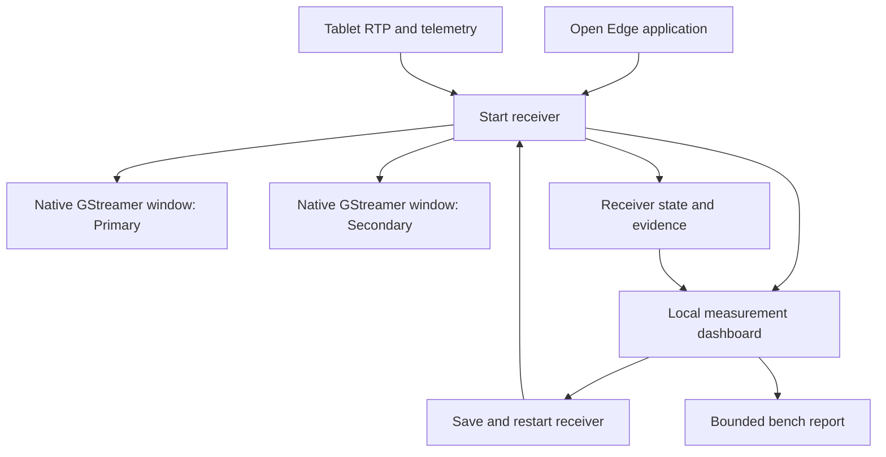
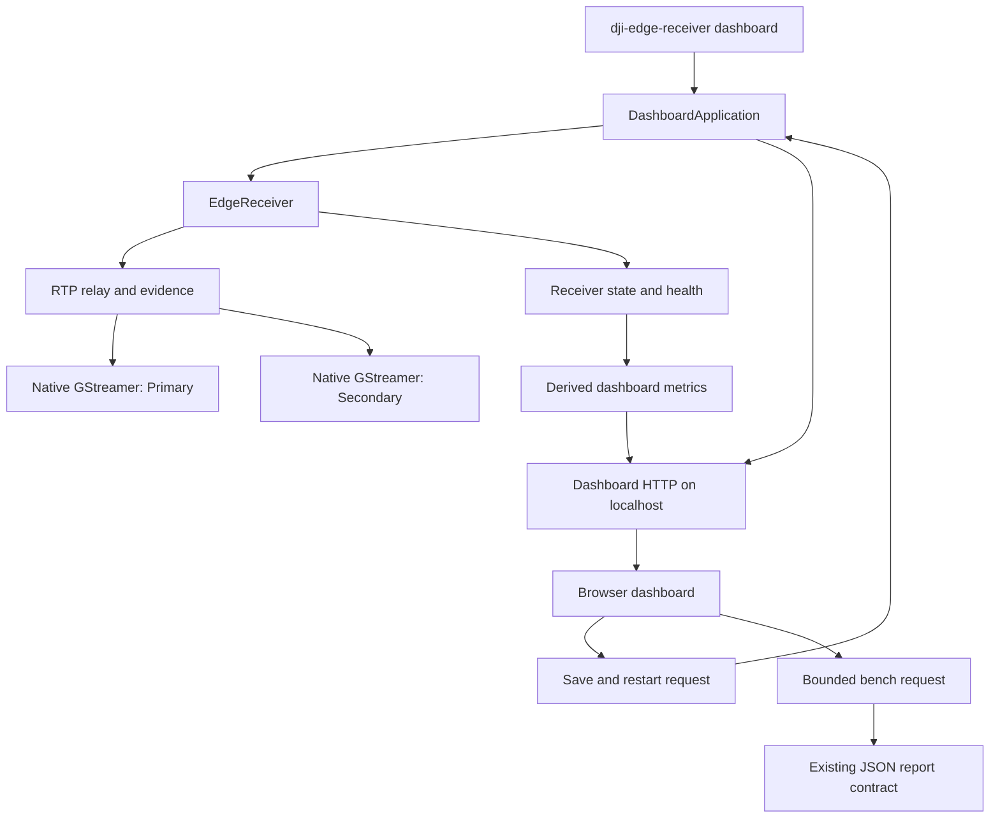

# Edge Measurement Dashboard - Plan

## Goal Capsule

- **Objective:** Let the operator prove, from one local application, whether each tablet-to-Ubuntu video and telemetry path is healthy and what transmission delay or loss it is experiencing.
- **Means:** A localhost-only dashboard supervisor with the existing native GStreamer video windows. (KTD1)
- **Product authority:** This plan covers the Ubuntu edge receiver's local measurement experience only. It does not change aircraft control, Android acquisition, or FPV packetization.
- **Open blockers:** None. Real FPV measurements remain dependent on the Android sender beginning to emit valid secondary RTP.
- **Execution profile:** Add pure metric/config tests before integrating the lifecycle and HTTP surface; finish with a graphical props-off smoke check.

---

## Product Contract

### Summary

Create a local dashboard that starts and supervises the receiver while the existing native GStreamer windows display Primary and Secondary video.
The dashboard consolidates configuration, network addresses, live transport health, telemetry, clock quality, and bounded bench measurements so the operator no longer needs several terminals.

### Problem Frame

The receiver already exposes useful state but it is split across terminal commands, JSON output, a standalone benchmark script, and separate GStreamer windows.
That makes it harder to distinguish a healthy camera feed from missing FPV, Android-side loss, kernel UDP drops, stale telemetry, or an unready clock mapping during a real props-off test.

### Key Decisions

- **Native video remains native.** The dashboard controls and reports the two existing GStreamer windows rather than embedding or re-streaming video in a browser. (session-settled: user-directed — chosen over embedded or hybrid browser video: preserve the existing lowest-latency video path.) Governs R2, R4, R8.
- **One explicit apply action.** Editing configuration is followed by a visible `Save and restart receiver` action that validates the change and restarts only the local receiver. (session-settled: user-directed — chosen over save-only configuration: the operator wants one application to apply the selected tablet address.) Governs R3, R7.
- **Measurements state their boundary.** The dashboard labels Android callback-to-edge values as transport estimates and never presents them as camera exposure-to-screen latency. Governs R12, R13.

### Actors

- A1. **Edge operator:** Configures the tablet address, starts a props-off session, watches live status, and captures a measurement report.
- A2. **Tablet sender:** Supplies RTP, frame sidecars, telemetry, and clock responses to the receiver.
- A3. **Edge receiver:** Validates and relays RTP, records evidence, owns GStreamer pipelines, and supplies the dashboard state.

### Requirements

**Launch and lifecycle**

- R1. Starting the local edge application opens one dashboard and starts the configured receiver.
- R2. A running receiver opens one native window for `primary` and one for `secondary` when those configured pipelines are enabled, even if a feed has not yet received valid video.
- R3. The dashboard provides a visible `Save and restart receiver` action that validates the proposed configuration, saves only a valid configuration, reports failure without replacing the active configuration, and restarts the local receiver only after a successful save.
- R4. The dashboard reports each feed independently as receiving, waiting for signal, degraded, disabled, or exited; absence of Secondary traffic must not make Primary appear unhealthy.

**Network and configuration**

- R5. The dashboard shows the IPv4 addresses usable by the Ubuntu host on the current local network, identifies the address currently used for the receiver bind, and makes the value easy to copy into the tablet transport UI.
- R6. The dashboard shows the tablet address configured for clock exchange and the network, storage, and per-feed settings that affect a measurement session.
- R7. The dashboard makes it clear when a saved tablet IP will take effect only after the receiver restart described in R3.

**Video health and impact**

- R8. For Primary and Secondary separately, the dashboard shows pipeline status, most recent packet age, encoded resolution, access-unit rate, bitrate, packet count, IDR age, and whether decoded-frame counting is available.
- R9. For each feed, the dashboard shows transport-impact counters: RTP sequence gaps, duplicate and out-of-order packets, relay errors, Linux kernel UDP drops, evidence-writer drops, and relevant Android sender callback/access-unit/RTP/drop counters.
- R10. The dashboard derives a concise health explanation from those values, naming the affected feed and the evidence behind the state rather than only changing a color.

**Telemetry and timing**

- R11. The dashboard presents the latest flight, gimbal, RTK, and Android health information with source age and callback rate, and distinguishes unavailable RTK from a valid RTK solution.
- R12. The dashboard presents Android-to-edge clock readiness, sample count, best/median RTT and offset quality when available.
- R13. Where a clock mapping and timestamped sidecar are available, the dashboard shows a clearly labelled callback-to-edge transport estimate for video metadata and telemetry; it shows unavailable rather than inventing a latency value when either prerequisite is absent.

**Bench measurement and evidence**

- R14. The operator can start and stop a bounded measurement from the dashboard without opening a terminal.
- R15. A completed measurement presents window-only deltas for each feed and telemetry source, including observed FPS, bitrate, gaps, drops, callback increments, clock state, and the evidence-report location.
- R16. The dashboard does not block RTP relay, decode, telemetry ingest, evidence writing, or clock exchange when it refreshes or renders its own state.

### Key Flows

- F1. Start a local session
  - **Trigger:** A1 opens the edge application.
  - **Actors:** A1, A3.
  - **Steps:** The receiver starts with its active configuration; the dashboard opens; configured native Primary and Secondary pipelines open; the dashboard begins showing health and state.
  - **Outcome:** A1 can see the receiver, both expected video surfaces, and their independent state from one place.
  - **Covers R1, R2, R4, R8.**

- F2. Apply a tablet address
  - **Trigger:** A1 edits configuration and selects `Save and restart receiver`.
  - **Actors:** A1, A3.
  - **Steps:** The dashboard validates the proposed configuration; invalid input remains unsaved with a reason; valid input is saved; the receiver is restarted; the dashboard reports the new running configuration.
  - **Outcome:** A1 knows whether the tablet clock destination changed and whether the receiver returned to healthy operation.
  - **Covers R3, R5, R6, R7.**

- F3. Diagnose a feed
  - **Trigger:** A1 observes Primary or Secondary in a non-healthy state.
  - **Actors:** A1, A2, A3.
  - **Steps:** The dashboard compares per-feed pipeline status, packet age, RTP/access-unit counters, Android sender counters, and loss/drop counters; it displays the observed reason and relevant timing context.
  - **Outcome:** A1 can distinguish no sender traffic, invalid/incomplete sender output, transport loss, decoder exit, and normal waiting state without treating FPV as Primary failure.
  - **Covers R4, R8, R9, R10, R12, R13.**

- F4. Capture a props-off measurement
  - **Trigger:** A1 starts a bench measurement.
  - **Actors:** A1, A3.
  - **Steps:** The dashboard marks the start state, samples the receiver during the selected bounded window, saves a report, and presents the resulting deltas.
  - **Outcome:** A1 receives comparable evidence for the actual test interval rather than lifetime counters.
  - **Covers R14, R15, R16.**

### Acceptance Examples

- AE1. **Covers R3, R7.**
  - **Given:** The operator enters an invalid tablet IP.
  - **When:** They choose `Save and restart receiver`.
  - **Then:** The dashboard identifies the validation problem, preserves the currently running configuration, and does not restart the receiver.

- AE2. **Covers R4, R8, R9, R10.**
  - **Given:** Primary is receiving valid RTP while Secondary has zero RTP packets.
  - **When:** The dashboard refreshes.
  - **Then:** Primary is reported independently as healthy or degraded from its own counters, and Secondary is shown as waiting/no traffic with its own evidence.

- AE3. **Covers R12, R13.**
  - **Given:** No valid clock exchanges have been collected.
  - **When:** The operator opens timing details.
  - **Then:** The dashboard reports clock mapping unavailable and does not display a numeric transport-latency estimate.

- AE4. **Covers R14, R15.**
  - **Given:** A receiver is running and the tablet transport is enabled.
  - **When:** The operator completes a 60-second measurement.
  - **Then:** The dashboard shows only counters accumulated in that interval and links the saved JSON report.

### Success Criteria

- The operator can complete a Primary-only props-off check without opening terminal windows after launching the application.
- The operator can determine, from the dashboard, whether a missing Secondary image means no traffic reached the edge or a Primary failure.
- The dashboard never represents a camera-exposure latency that the system does not measure.
- Dashboard refreshes leave receiver ingest and native video playback responsive during a sustained measurement.

<!-- ce-section: work-relationships -->
### How This Work Fits Together

This plan owns the local observability and configuration surface around the current non-ROS receiver.

- **Depends on:** The existing receiver state, health, evidence, clock, and GStreamer pipelines.
- **Can proceed independently of:** Android FPV packetization repair; the dashboard must reveal its current zero-traffic state.
- **Enables:** Reproducible props-off measurements before a future ROS 2 `appsink` adapter.
- **Still to decide:** The final ROS 2 decode and publication boundary remains a separate plan.

### Scope Boundaries

- Native GStreamer windows remain the live video presentation path; browser video preview is not part of this version.
- The dashboard controls only the Ubuntu receiver process and local configuration; it cannot issue aircraft, mission, gimbal, or tablet transport commands.
- It does not change RTP packetization, H.264 encoding, Android telemetry callbacks, or FPV sender behavior.
- It does not expose receiver control or telemetry to untrusted networks.

### Dependencies and Assumptions

- The local receiver continues to expose its state and health independently of the dashboard.
- Primary and Secondary remain configured as separate named feeds with independent GStreamer pipelines.
- The Ubuntu host has a graphical session suitable for the configured native GStreamer sinks.
- Valid transport estimates require current Android timestamps and a ready Android-to-edge clock mapping.

### Sources and Research

- `dji_edge_receiver/server.py` — current local HTTP state and receiver lifecycle.
- `dji_edge_receiver/video.py` — feed-specific pipeline and RTP health boundary.
- `dji_edge_receiver/config.py` — current configuration validation boundary.
- `scripts/capture_transport_bench.py` — bounded-window evidence semantics.
- `GUIA_DE_UTILIZACAO.md` — current props-off operating procedure and timing limitations.

---

## Planning Contract

Product Contract preservation: Product Contract unchanged.

### Key Technical Decisions

- KTD1. **Keep the dashboard supervisor separate from the receiver HTTP server.** A localhost dashboard process owns an in-memory `EdgeReceiver` and remains available while that receiver stops and starts; the existing receiver state endpoint remains intact for scripts and diagnostics. Governs R1, R3, R16.
- KTD2. **Use a dependency-free local web surface.** Serve packaged HTML, CSS, and JavaScript from the Python application, polling a compact derived status model at a bounded interval instead of adding a frontend build chain. Governs R4-R13, R16.
- KTD3. **Treat the tablet clock address as the editable operational setting.** Patch the existing `android_clock_host` assignment atomically, validate by loading the candidate TOML, retain the prior file for restart rollback, and leave all other TOML content untouched. Governs R3, R6, R7.
- KTD4. **Derive operator metrics at the edge boundary.** Convert raw receiver state into feed-specific health, loss, freshness, and callback-to-edge delay values in pure Python; only `edge_receive_mono_ns - mapped_edge_mono_ns` is a transport estimate. Governs R8-R13.
- KTD5. **Reuse the bench report contract.** Move the bounded sampling loop behind a reusable API so the CLI script and dashboard produce the same report schema and window-only deltas. Governs R14-R16.

### High-Level Technical Design

The dashboard server stays bound to loopback and owns lifecycle serialization with one lock.
The receiver keeps its present UDP ports, GStreamer subprocesses, evidence writer, and `/health` and `/v1/state` behavior.
Restart first stops the old receiver, validates and starts the replacement, and restores the prior TOML plus receiver if the replacement cannot start.

### Design Direction

The UI is a calm instrument panel, not a terminal rendered in a browser.
Use a deep blue-black canvas, slate surfaces, soft cyan for healthy live signals, amber for waiting/degraded conditions, and a restrained coral only for stopped/error states.
Use a highly legible data face for metrics and a compact humanist face for labels; the signature element is a thin live-signal rail that connects each feed card to its native window state without adding dashboard video.
Prioritize hierarchy, generous spacing, explicit empty/error states, keyboard focus, and reduced-motion support over visual decoration.

### Assumptions

- The dashboard launch command is used from a graphical Ubuntu desktop session; a failed browser-open attempt is reported while the local URL remains available.
- A three-second packet-freshness threshold is appropriate for the props-off transport dashboard and can be revisited after sustained hardware measurements.
- The only dashboard mutation in this version is the tablet clock IP; receiver bind, ports, evidence policy, and GStreamer sink are displayed but remain file-managed settings.

### System-Wide Impact

- Existing `run`, `print-gstreamer`, packet validation, systemd, and evidence scripts remain supported.
- `dashboard` is a desktop-local operating mode and must not be substituted into the headless systemd template.
- Receiver state remains the source of truth; the dashboard is a bounded consumer and never sits on the RTP or telemetry ingest path.

---

## Implementation Units

### U1. Add dashboard configuration and lifecycle ownership

- **Goal:** Add a local dashboard launch mode that owns receiver start, stop, restart, signal shutdown, and browser opening without changing normal receiver mode.
- **Requirements:** R1, R2, R3, R5-R7, R16; F1, F2; AE1.
- **Dependencies:** None.
- **Files:** `dji_edge_receiver/config.py`, `dji_edge_receiver/cli.py`, `dji_edge_receiver/dashboard.py`, `tests/test_config.py`, `tests/test_dashboard.py`, `pyproject.toml`.
- **Approach:**
  1. Extend validated configuration with a `127.0.0.1`-only dashboard host, port, and browser-open defaults while keeping configurations without a dashboard table valid; reject any non-loopback dashboard host.
  2. Introduce `DashboardApplication` as the lifecycle owner for one `EdgeReceiver`, a separate dashboard HTTP server, and orderly signal shutdown.
  3. Add the `dashboard` CLI subcommand that starts this application and attempts to open its local URL once; preserve the existing `run` command unchanged.
  4. Package static dashboard resources with the Python distribution.
- **Execution note:** Begin with lifecycle tests using `gstreamer_enabled=false` and ephemeral ports so desktop/GStreamer availability cannot make the controller tests flaky.
- **Patterns to follow:** `EdgeReceiver.start()`/`stop()` in `dji_edge_receiver/server.py`; CLI command parsing in `dji_edge_receiver/cli.py`; dataclass validation in `dji_edge_receiver/config.py`.
- **Test scenarios:**
  - A config with no dashboard section loads with loopback-only defaults.
  - A non-loopback dashboard host or invalid port is rejected before any socket starts.
  - Starting the application starts its receiver and exposes a dashboard URL while preserving receiver `/v1/state`.
  - A stop request closes dashboard and receiver resources exactly once.
  - Browser launch failure leaves the dashboard running and reports the local URL.
- **Verification:** The dashboard command can start and stop a test receiver without modifying the behavior of the existing `run` command.

### U2. Build pure configuration and measurement view models

- **Goal:** Make all dashboard values and feed explanations deterministic, testable, and independent of the browser.
- **Requirements:** R4-R13, R16; F3; AE2, AE3.
- **Dependencies:** U1.
- **Files:** `dji_edge_receiver/dashboard_metrics.py`, `dji_edge_receiver/config.py`, `tests/test_dashboard_metrics.py`, `tests/test_dashboard.py`.
- **Approach:**
  1. Create pure functions that normalize receiver state, runtime health, active config, and local IPv4 discovery into a compact dashboard snapshot.
  2. Classify each feed independently from pipeline state, packet freshness, relay errors, kernel drops, evidence health, and sender counters.
  3. Compute callback-to-edge delay only from a mapped Android timestamp and the original edge receive timestamp; expose `null` with a reason when the mapping or source timestamp is missing.
  4. Surface raw counters alongside a concise human explanation so a status color is never the only diagnostic.
- **Patterns to follow:** `LatestState.snapshot()` in `dji_edge_receiver/state.py`; `EdgeReceiver.runtime_health()` and feed health in `dji_edge_receiver/server.py` and `dji_edge_receiver/video.py`; clock semantics in `dji_edge_receiver/clock.py`.
- **Test scenarios:**
  - A live Primary with recent packets is independent from a Secondary feed with no traffic.
  - A feed with no packets is waiting, a formerly active stale feed is degraded, and an exited pipeline is exited.
  - Sequence gaps, kernel drops, relay errors, and evidence writer errors appear in the feed/global impact model.
  - H.264 SPS resolution, access-unit FPS, bitrate, and decoded-frame availability map without claiming decoded frames.
  - Ready clock plus mapped source timestamps produces callback-to-edge delay; missing prerequisites return unavailable with explanation.
  - IPv4 discovery excludes loopback and reports an empty candidate list honestly when no usable IPv4 is found.
- **Verification:** Given fixture states, every displayed health state and latency label is reproducible without network, GStreamer, or browser processes.

### U3. Add loopback dashboard API and safe apply/restart flow

- **Goal:** Serve status and configuration controls locally while preserving the last working receiver if an update cannot start.
- **Requirements:** R3-R7, R10-R13, R16; F2, F3; AE1-AE3.
- **Dependencies:** U1, U2.
- **Files:** `dji_edge_receiver/dashboard.py`, `dji_edge_receiver/config.py`, `tests/test_dashboard.py`.
- **Approach:**
  1. Serve the dashboard document and a small localhost-only API for current derived status, displayed configuration, configuration apply, and receiver lifecycle result.
  2. Accept only the tablet clock IPv4 edit; reject malformed JSON, non-string values, invalid IP addresses, and concurrent apply requests without touching the active file.
  3. Write a candidate configuration through a temporary sibling file, validate it with the existing loader, then atomically replace the active TOML.
  4. Serialize restart under the application lock; if replacement startup fails, restore the previous TOML and attempt to restore the previous receiver before returning an actionable error.
- **Patterns to follow:** Loopback HTTP handling in `StateHttpServer`; `load_config()` and `validate_config()` as the authoritative configuration validation; evidence of atomic behavior through temporary-directory tests.
- **Test scenarios:**
  - The dashboard API is available only at the configured loopback address and returns no-store status data.
  - A valid tablet IP persists, restarts the fake/test receiver, and is reflected in the next status response.
  - Covers AE1. An invalid IP leaves file contents, active receiver instance, and dashboard availability unchanged.
  - A simulated receiver startup failure restores prior config and receiver, then reports a restart error without exposing a false healthy state.
  - Parallel apply attempts are serialized and cannot produce mixed configuration or two receivers.
- **Verification:** A local HTTP integration test proves edit, validation, restart, rollback, and independent state refresh against an ephemeral receiver.

### U4. Reuse bounded bench capture from the dashboard

- **Goal:** Run, cancel, persist, and present interval-only transport measurements without a terminal while retaining the existing report format.
- **Requirements:** R14-R16; F4; AE4.
- **Dependencies:** U1, U2, U3.
- **Files:** `scripts/capture_transport_bench.py`, `dji_edge_receiver/dashboard.py`, `tests/test_bench_report.py`, `tests/test_dashboard.py`.
- **Approach:**
  1. Extract sampling, summary, cancellation, and report-writing helpers from the script into reusable functions while keeping its current command-line interface and output schema.
  2. Run one bench capture at a time in a dedicated worker controlled by an event; sample the in-memory state provider at the same bounded cadence.
  3. Save completed or operator-stopped reports under the existing `.runtime/bench` location and publish progress, effective duration, summary, and path through dashboard status.
  4. Keep all sampling and JSON writing outside receiver ingest and dashboard request threads.
- **Patterns to follow:** Existing `summary()` and report naming in `scripts/capture_transport_bench.py`; evidence location and non-overwrite behavior documented in `GUIA_DE_UTILIZACAO.md`.
- **Test scenarios:**
  - Existing CLI capture still writes a schema-compatible report from HTTP state.
  - Dashboard capture emits the same interval deltas for synthetic first/last samples.
  - Covers AE4. A 60-second requested run records only its window counters and links its report.
  - Cancelling a capture produces a valid partial report with actual measured duration.
  - A second start while a capture is running is rejected with its current progress rather than launching a competing worker.
- **Verification:** Script and dashboard fixtures produce equivalent summaries for the same sample sequence.

### U5. Deliver the smooth local instrument panel and operating guide

- **Goal:** Make the dashboard legible at a glance and usable without auxiliary terminals.
- **Requirements:** R1-R15; F1-F4; AE1-AE4.
- **Dependencies:** U2, U3, U4.
- **Files:** `dji_edge_receiver/dashboard_static/index.html`, `dji_edge_receiver/dashboard_static/app.css`, `dji_edge_receiver/dashboard_static/app.js`, `pyproject.toml`, `GUIA_DE_UTILIZACAO.md`, `README.md`, `tests/test_dashboard.py`.
- **Approach:**
  1. Build one responsive measurement page with a fixed status rail, Primary and Secondary feed cards, transport impact, timing, telemetry/RTK, configuration, and bench sections.
  2. Poll the compact dashboard snapshot at a bounded interval, render explicit loading/empty/error states, and preserve the latest good snapshot during a receiver restart.
  3. Use the Design Direction in the Planning Contract: deep instrument palette, legible metric typography, restrained signal motion, accessible contrast, visible focus, and reduced-motion behavior.
  4. Label the exact timing boundary near every latency value and make the Ubuntu IP copy action and `Save and restart receiver` action unambiguous.
  5. Update the guide with one-launch workflow, expected windows, safety boundary, configuration apply behavior, and benchmark interpretation.
- **Patterns to follow:** State field names and measurement limitations in `GUIA_DE_UTILIZACAO.md`; current GStreamer window behavior in `dji_edge_receiver/video.py`.
- **Test scenarios:**
  - Static resources are served with the expected content type and the dashboard shell loads without receiver data.
  - Rendering fixture checks cover no-signal Secondary, degraded Primary, unavailable RTK, unavailable clock delay, active bench, and failed restart messages.
  - UI copy labels callback-to-edge delay and never labels it camera or exposure latency.
  - Static UI checks verify visible keyboard focus and reduced-motion rules are present without depending on a browser test framework.
  - Manual smoke: launching dashboard opens browser plus both configured native windows, copy action copies an Ubuntu IPv4, and invalid configuration does not interrupt the visible Primary stream.
- **Verification:** A props-off operator can use the guide to launch one application, inspect both feeds, apply a tablet IP, and save a bench report without opening terminals.

---

## Verification Contract

| Surface | Verification | Done signal |
| --- | --- | --- |
| Existing receiver regression | `.venv/bin/python -m unittest discover -s tests -v` | Existing protocol, state, video, H.264, and receiver integration tests still pass. |
| Dashboard state and config | Dashboard unit and HTTP integration tests | Feed classification, delay boundary, IPv4 discovery, apply, restart, and rollback are deterministic. |
| Bench parity | Script and dashboard report fixtures | Equivalent sample input produces the same summary schema and deltas. |
| Desktop runtime | Props-off graphical smoke on Ubuntu | Browser dashboard and both configured native video windows open; no new relay, evidence, or pipeline errors appear. |
| Documentation | Follow the updated one-launch guide from a fresh terminal | The operator reaches live status and a saved measurement without assembling manual curl or benchmark commands. |

---

## Definition of Done

- U1 is complete when normal receiver mode remains unchanged and dashboard mode owns an independently reachable local control surface.
- U2 is complete when feed health, video metrics, transport impact, local addresses, and delay availability are derived without false decoded-frame or exposure-time claims.
- U3 is complete when invalid input and failed restart cannot strand the operator without a dashboard or silently replace a working configuration.
- U4 is complete when terminal and dashboard captures share the same report semantics and only one capture runs at a time.
- U5 is complete when the documented single-launch props-off workflow exposes Primary and Secondary windows plus an accessible, responsive dashboard.
- The full suite passes, the graphical smoke check is recorded, and no abandoned experimental dashboard path remains in the codebase.

---

## Risks and Deferred Work

- Desktop browser or display-session launch may fail on a headless host; the dashboard must print its local URL and keep the receiver usable.
- Restarting an active receiver intentionally produces a short data interruption; rollback minimizes the interruption when a replacement cannot start.
- The three-second freshness threshold is an operator-facing heuristic, not a packet-loss measurement; actual loss remains represented by counters.

### Deferred to Follow-Up Work

- Embedding, streaming, or re-encoding video inside the browser.
- ROS 2 `appsink` decode, image publication, and decoded-frame accounting.
- Android sender changes, including Secondary/FPV AVCC packetization and RTK callback availability.
- Remote dashboard access, authentication, or fleet/multi-tablet management.
