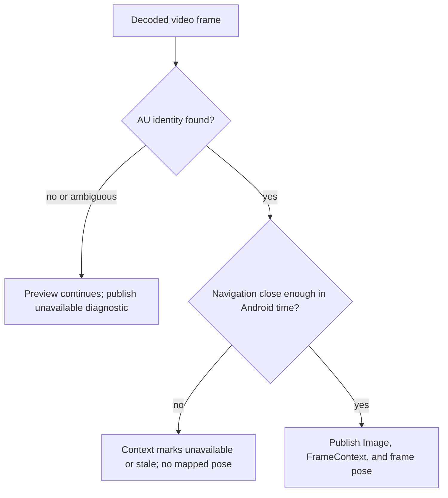

# Frame-Accurate Video Georeferencing - Plan

## Goal Capsule

- **Objective:** An operator can trust that the vehicle pose, heading, and gimbal pitch visualized with a ROS image describe that same received video frame, so a future detection has an auditable location basis rather than the latest unrelated telemetry sample.
- **Means:** Preserve Android monotonic timestamps and AU identity end-to-end, correlate decoded frames to their originating RTP access units, and select navigation history by the frame's canonical Android time. (KTD1, KTD2, KTD3)
- **Authority:** Android remains responsible for DJI callbacks and the frozen UDP/RTP ports. The Edge may add bounded correlation state and ROS publications, but may not command aircraft, mission, or gimbal behavior.
- **Operating priorities:** KISS first, then low latency and reliable behavior. Reuse the existing two ROS packages, direct UDP/RTP ingress, single GStreamer decode, and bounded newest-frame policy; do not add a relay, a third package, a second decoder, or an unbounded synchronization queue.
- **Stop conditions:** Do not claim camera-exposure accuracy unless DJI provides a documented source timestamp. Do not publish a guessed geographic association when an AU, time mapping, or sufficiently close navigation sample is unavailable.

---

## Product Contract

### Summary

The direct ROS Edge path will associate each delivered Primary or FPV image with the original Android-monotonic time and the interpolated or nearest valid navigation state for that same moment.
The map path remains a continuous navigation history, while RViz receives a separate frame-synchronous vehicle pose for the currently displayed ROS image.

### Problem Frame

The current driver records Android `video_au` metadata and publishes navigation independently, but it publishes each ROS image with a new Edge/ROS-time header and the mapper consumes the most recent `NavigationState`.
The resulting RViz image and vehicle marker may both look live while referring to different moments.
That is unacceptable for a future detection pipeline that must retain an auditable relationship between an observed image, aircraft pose, heading, and gimbal pitch.

### Requirements

**Canonical time and identity**

- R1. Every accepted flight, RTK, gimbal, and video-AU record retains its Android monotonic timestamp exactly as received. This is the canonical correlation time throughout the Edge pipeline.
- R2. Every video frame context has a stable identity consisting of session, logical feed, frame sequence, RTP SSRC, and RTP timestamp. Edge-side arrival, decode, and ROS-publication observations must not replace or be represented as the original frame or telemetry timestamp.
- R3. If Android supplies a DJI-origin timestamp or PTS, Edge preserves it with an explicit source/clock descriptor. It remains optional and is never converted into a camera-exposure claim without hardware evidence.

**Correlation and publication**

- R4. Edge associates a decoded image only when it can correlate it to one received `video_au` identity. Missing, ambiguous, duplicate, expired, or out-of-order associations are explicitly dropped or marked unavailable without adding queue latency.
- R5. For each associated image, Edge selects navigation and gimbal state by its canonical Android monotonic time from a bounded history. The result states whether position is exact, interpolated, nearest, stale, or unavailable, and includes the temporal offset used.
- R6. The driver publishes a typed per-frame context for each ROS image without duplicating encoded or decoded video payloads. Existing image topics remain `/dji/primary/image_raw` and `/dji/fpv/image_raw`.
- R7. The mapper publishes a frame-synchronous pose/visualization for the current image context. `/dji/navigation/path` remains the continuous trajectory history and is not reinterpreted as one image's pose.

**Safety, latency, and evidence**

- R8. Correlation state is bounded and expiration-driven. Slow ROS consumers, delayed metadata, or failed association must drop stale work rather than delay native GStreamer preview or accumulate frames.
- R9. NDJSON evidence records identity, original Android timestamps, association decision, and Edge-only transport observations in distinct fields. Dashboard and diagnostics must label original source time separately from Edge timing metrics.
- R10. The Android wire ports and RTP payload contract remain unchanged: telemetry `5500`, frame metadata `5501`, clock `5502`, Primary `5600`, FPV `5610`, and RTP payload type `96`.
- R11. The implementation remains KISS: it extends only `dji_edge_driver` and `dji_edge_mapper`, reuses the existing direct ingress and one-decode pipeline, and introduces no relay, extra video transport, third ROS package, or unbounded buffer.

### Key Decisions

- **Android monotonic time is canonical** (session-settled: user-directed — chosen over assigning Edge timestamps to frames or telemetry: the original tablet timing must remain intact for trustworthy association). Governs R1, R2, R5, R9.
- **Edge timestamps are diagnostic observations only** (session-settled: user-directed — chosen over using Edge receive/decode/publication time as frame time: latency measurement must not corrupt source identity). Governs R2, R8, R9.

### Key Flows

- F1. **Frame-context flow:** Android finishes one access unit, emits RTP and one `video_au` identity record, and Edge matches the decoded image to that identity before publishing image context and frame pose.
- F2. **Navigation-selection flow:** A frame's Android monotonic time selects RTK-preferred/GPS-fallback position and the corresponding heading/gimbal sample from history; the association quality is published with the result.
- F3. **Uncertain-data flow:** If correlation or navigation is absent or too far from the frame time, Edge keeps live preview responsive, withholds a false pose association, and records the reason in diagnostics/evidence.

### Acceptance Examples

- AE1. Given a synthetic RTP AU and a navigation history containing known Android-monotonic samples before and after it, when the image is decoded, then its context identifies that AU and contains the expected interpolated pose/heading/pitch and quality.
- AE2. Given a decoded image whose metadata record has not arrived before the bounded deadline, when the deadline expires, then the image path does not wait indefinitely and diagnostics record an unavailable association rather than using latest navigation.
- AE3. Given RTK becomes invalid around a frame time while valid Flight GPS exists, when a context is built, then the selected frame state declares GPS fallback and preserves relative aircraft altitude.
- AE4. Given a detection consumes one published image and its context, when it marks an observation, then it can retain the exact frame identity and association quality used for that mark.

### Success Criteria

- A recorded props-off session can demonstrate a one-to-one image/context pairing for each accepted published frame.
- A known synthetic timeline proves that frame pose differs from the newest telemetry pose when appropriate, and follows the frame time instead.
- Dashboard/evidence make it impossible to confuse Android source time with Edge observation time.

### Scope Boundaries

- In scope: Edge driver/mapper synchronization, ROS context/pose publication, protocol documentation, evidence/diagnostics, RViz configuration, and test fixtures.
- In scope as a cross-repository prerequisite: Android preserves and emits the existing `video_au` identity and Android monotonic times, and reports an optional DJI source timestamp only when available.
- Out of scope: person/object detection, segmentation, ray-casting a camera detection onto the point cloud, camera intrinsics/extrinsics calibration, and flight-control behavior.
- **Deferred to Follow-Up Work:** World-space red markers require camera calibration plus an intersection/depth strategy. This plan provides the synchronized aircraft/camera context they will consume; it does not pretend a vehicle position alone locates an object on the ground.

---

## Planning Contract

### Key Technical Decisions

- KTD1. **Use Android monotonic time as immutable source data** (session-settled: user-directed — chosen over assigning Edge timestamps to frames or telemetry: source identity must survive every stage). Edge observation times live in an explicitly named transport-observation structure and are excluded from frame/nav selection. Governs R1, R2, R3, R9.
- KTD2. **Correlate at the AU/RTP boundary, not from “latest state.”** Build a bounded index keyed by `(session, feed, rtp_ssrc, rtp_ts)` from `video_au`, then bind it to GStreamer's decoded output through a measured RTP-to-GStreamer timestamp mapping. `GstBuffer` PTS is an internal matching mechanism only, because it is a presentation timestamp and may be absent. Governs R2, R4, R8.
- KTD3. **Publish a lightweight context beside, not inside, the image.** Add one custom context message per logical feed with the source identity, chosen navigation/gimbal values, and association quality. Keep `sensor_msgs/Image` payloads unchanged and avoid a second image copy. Governs R5, R6.
- KTD4. **Synchronize the RViz vehicle marker to the displayed ROS frame.** The mapper consumes frame context to publish a frame-synchronous pose and TF/marker path distinct from continuous navigation pose/path. Native GStreamer preview remains a low-latency monitor; the RViz Image + frame pose is the auditable correlated view. Governs R7, R8.
- KTD5. **Fail closed for geography, fail open for viewing.** A missing or ambiguous match never stops video preview, but it never yields a guessed pose for mapping/detection. Governs R4, R5, R8.
- KTD6. **Keep correlation deliberately small.** The feature is a bounded index plus one lightweight context topic inside the existing driver/mapper boundary, not a general-purpose synchronization service. It drops uncertain/stale associations instead of buffering them, preserving the existing low-latency architecture. Governs R8, R11.

### High-Level Technical Design

```mermaid
sequenceDiagram
  participant A as Android tablet
  participant D as Edge driver
  participant G as GStreamer
  participant M as Edge mapper
  participant R as RViz/detection

  A->>D: telemetry with immutable Android monotonic time
  A->>D: video_au identity and Android AU times
  A->>G: RTP/H264 for the same AU
  G->>D: decoded frame with internal GStreamer timing
  D->>D: bind frame to AU identity; select navigation history by Android time
  D->>R: Image plus FrameContext
  D->>M: FrameContext
  M->>R: frame-synchronous pose/TF; continuous path remains separate
```



### Dependencies and Prerequisites

- The Android transport must continue emitting one `video_au` record per completed AU, with frame sequence, SSRC, RTP timestamp, and Android monotonic AU times.
- Before adding an optional DJI timestamp field, the Android owner must document the exact callback/API source, its clock domain, and whether it is capture, receive, decode, or presentation time.
- A props-off bench is required to characterize the actual Android RTP/GStreamer timestamp relationship for both feeds. Synthetic fixtures prove code logic but cannot prove the DJI callback's source-time semantics.

### Risks and Mitigations

- **RTP-to-decoded-frame mapping may be absent or altered by the pipeline.** Instrument the post-jitter and appsink boundaries first; if a stable relationship cannot be demonstrated, publish no correlated frame pose and keep the existing image/navigation paths operational.
- **Metadata and RTP may reorder across UDP ports.** Use a short bounded pending cache and explicit expiration rather than blocking decode or retaining an unbounded queue.
- **Telemetry cadence is lower than video cadence.** Interpolate only within documented bounded gaps; otherwise label nearest/stale/unavailable. Heading interpolation must respect angle wraparound.
- **RTK/GPS source transitions near a frame.** Preserve the selected source and validity in every context; do not blend RTK and GPS values invisibly.
- **ROS header clock differs from Android monotonic time.** Treat ROS header time as ROS delivery bookkeeping only. It must never be exposed as original frame/telemetry time or used as the correlation key.

### Sources and Research

- `docs/PROTOCOL_V1.md` defines `rx_mono_ns` as Android `elapsedRealtimeNanos()` and identifies Android-minus-Edge clock mapping as latency measurement, not camera source time.
- `src/dji_edge_driver/dji_edge_transport_core/protocol.py` already validates AU identity and Android AU timing fields.
- `src/dji_edge_driver/dji_edge_transport_core/state.py` already retains bounded per-stream history but only exposes the latest frame metadata today.
- [GStreamer GstBuffer documentation](https://gstreamer.freedesktop.org/documentation/gstreamer/gstbuffer.html) documents that PTS can be absent and is a presentation timestamp; [rtpjitterbuffer documentation](https://gstreamer.freedesktop.org/documentation/rtpmanager/rtpjitterbuffer.html) documents its RTP-timestamp-based PTS construction.

---

## Implementation Units

### U1. Specify immutable timing and context contract

- **Goal:** Make the Android-origin identity, optional DJI source timestamp, and Edge-only observation timing unambiguous in protocol and ROS interfaces.
- **Requirements:** R1, R2, R3, R6, R9, R10.
- **Dependencies:** None.
- **Files:** `docs/PROTOCOL_V1.md`, `src/dji_edge_driver/msg/FrameContext.msg`, `src/dji_edge_driver/CMakeLists.txt`, `src/dji_edge_driver/package.xml`, `src/dji_edge_driver/test/test_transport_core.py`.
- **Approach:** Define the per-frame context fields and association-quality vocabulary. State that Android monotonic fields are immutable source data, that an optional DJI source value carries an explicit clock/source label, and that Edge timings are diagnostics only. Retain the existing wire ports and RTP payload type per R10.
- **Test scenarios:**
  - A valid `video_au` creates an identity with session, feed, frame sequence, SSRC, RTP timestamp, and Android monotonic time.
  - A missing or invalid identity component is rejected without polluting frame correlation state.
  - An optional DJI timestamp with a declared source is preserved without replacing Android monotonic time.
  - Edge diagnostic fields cannot be selected as a frame's canonical source time.
- **Verification:** ROS interface inspection and protocol tests demonstrate one documented source-time contract and no ambiguous timestamp field names.

### U2. Build bounded temporal correlation state

- **Goal:** Retain only the recent AU and navigation records required to select a frame's own pose and gimbal state.
- **Requirements:** R1, R2, R4, R5, R8, R9.
- **Dependencies:** U1.
- **Files:** `src/dji_edge_driver/dji_edge_transport_core/state.py`, `src/dji_edge_driver/dji_edge_transport_core/navigation.py`, `src/dji_edge_driver/dji_edge_transport_core/synchronization.py`, `src/dji_edge_driver/test/test_transport_core.py`.
- **Approach:** Extend the existing bounded history pattern with per-feed AU identity lookup and time-ordered Flight/RTK/Gimbal selection. Implement explicit temporal quality and gap limits, including circular heading handling and source-aware RTK/GPS choice. Expire pending records deterministically and expose counters/reasons without retaining pixel data.
- **Execution note:** Begin with characterization tests for current latest-state behavior, then prove each time-selection policy with deterministic synthetic Android-monotonic timelines.
- **Test scenarios:**
  - Navigation samples bracketing a frame produce the expected interpolated position, heading, and gimbal pitch within configured limits.
  - A frame before/after valid samples uses nearest only inside the configured window and otherwise reports unavailable.
  - RTK is selected only when valid/in-use at the relevant frame time; Flight GPS remains continuous fallback.
  - Duplicate, out-of-order, stale, and expired AU metadata cannot associate to a later frame.
  - Session rollover clears all AU and navigation correlation state.
- **Verification:** Unit tests demonstrate bounded memory, deterministic selection, and no fallback to the latest unrelated telemetry sample.

### U3. Bind GStreamer output to video-AU identity

- **Goal:** Establish and prove the internal mapping between incoming RTP AUs and decoded GStreamer frames without using Edge time as source identity.
- **Requirements:** R2, R4, R8, R9.
- **Dependencies:** U1, U2.
- **Files:** `src/dji_edge_driver/scripts/dji_edge_driver_node.py`, `src/dji_edge_driver/dji_edge_transport_core/video.py`, `src/dji_edge_driver/dji_edge_transport_core/rtp.py`, `src/dji_edge_driver/test/test_transport_core.py`.
- **Approach:** Capture the logical RTP identity and pipeline timing at a post-jitter/depay boundary, verify its propagation to decoded samples, and use the resulting bounded mapping to request frame context. Preserve the one-decode, leaky-branch, newest-frame policy. If mapping is missing or ambiguous, retain preview and emit an unavailable association rather than attaching latest navigation.
- **Test scenarios:**
  - A fixture with known RTP timestamps produces decoded frames paired to the matching AU identities in order.
  - A missing `video_au`, repeated RTP timestamp, invalid PTS, or expiration produces no false context and increments the appropriate reason counter.
  - Delayed metadata reaches the bounded pending window without blocking native preview; metadata after expiry is rejected.
  - A slow/no ROS subscriber still avoids pixel copies and cannot increase preview latency.
  - Driver shutdown during active samples leaves no ROS-context publication error or pending worker.
- **Verification:** A synthetic RTP characterization test proves the observed mapping end-to-end before it is relied on for geographic publication.

### U4. Publish synchronized ROS context and RViz pose

- **Goal:** Make the auditable ROS/RViz view show a frame-synchronous aircraft pose while retaining the existing continuous path and map behavior.
- **Requirements:** R5, R6, R7, R8, R9.
- **Dependencies:** U2, U3.
- **Files:** `src/dji_edge_driver/scripts/dji_edge_driver_node.py`, `src/dji_edge_driver/launch/dji_edge_driver.launch.py`, `src/dji_edge_mapper/scripts/drone_localization_node.py`, `src/dji_edge_mapper/config/mapper.yaml`, `src/dji_edge_mapper/config/mapper.local.yaml.example`, `src/dji_edge_mapper/rviz/dji_edge_mapper.rviz`, `src/dji_edge_driver/test/test_transport_core.py`.
- **Approach:** Publish one context event beside each ROS image, then have the mapper project its selected position into a dedicated current-frame pose/TF or visualization topic. Keep the existing navigation-driven `/dji/navigation/path` as history. RViz displays Primary/FPV image topics and the frame-synchronous pose distinctly from the continuous path, with an explicit unavailable state.
- **Test scenarios:**
  - A context with valid localizable state produces the expected map-frame pose and orientation.
  - A context marked unavailable/stale does not move the correlated frame marker to the latest navigation pose.
  - The existing path still grows only from accepted navigation samples and preserves RTK/GPS status.
  - RViz configuration loads with map/path/current-frame pose/image displays while a public clone without map calibration remains cleanly disabled.
- **Verification:** ROS topic introspection shows a one-to-one image/context publication path and RViz makes current-frame pose visually distinct from trajectory history.

### U5. Make evidence and hardware proof association-aware

- **Goal:** Turn synchronization correctness into inspectable bench evidence rather than a visual assumption.
- **Requirements:** R3, R4, R5, R8, R9, R10.
- **Dependencies:** U1, U2, U3, U4.
- **Files:** `src/dji_edge_driver/dji_edge_transport_core/evidence.py`, `src/dji_edge_driver/dji_edge_transport_core/dashboard.py`, `src/dji_edge_driver/scripts/capture_transport_bench.py`, `README.md`, `docs/PROTOCOL_V1.md`, `src/dji_edge_driver/test/test_transport_core.py`.
- **Approach:** Add session evidence and dashboard fields for original source identity, association quality/reason, temporal offset, and Edge transport observations in separately named groups. Extend the bench report to show association coverage and failures per feed. Document the props-off test that validates Android contract, Primary/FPV correlation, RTK/GPS transitions, and gimbal pitch.
- **Test scenarios:**
  - Evidence records source timestamps and Edge observations in separate named fields.
  - Dashboard reports unavailable correlation honestly when clock mapping or AU association is absent.
  - Bench output counts valid, interpolated, nearest, stale, and unavailable contexts independently per feed.
  - A hardware capture can be traced from Android `video_au` through received RTP, decoded image, context, and current-frame pose by the same identity.
- **Verification:** A session report supports post-run review without inferring source time from Edge arrival or ROS delivery timestamps.

---

## Verification Contract

| Gate | Applies to | Proof |
| --- | --- | --- |
| Interface and protocol tests | U1 | ROS messages and parser tests reject incomplete identities and preserve Android source times unchanged. |
| Temporal selection tests | U2 | Deterministic timelines prove interpolation/nearest/stale/unavailable behavior, RTK preference, GPS fallback, heading wrap, and session reset. |
| RTP-to-frame characterization | U3 | Synthetic H.264/RTP fixture proves the observed GStreamer mapping or explicitly disables correlation when it cannot be proven. |
| ROS/mapper integration | U4 | Image/context/frame-pose publications share one identity; current-frame visualization does not silently use latest navigation. |
| Evidence/dashboard tests | U5 | Dashboard and session NDJSON distinguish Android source time from Edge transport observations and report association coverage. |
| Props-off hardware bench | U1-U5 | Primary and FPV are independently traced from Android AU metadata to the corresponding ROS image/context; RTK/GPS and gimbal behavior are recorded as actual observed state. |
| Regression suite | U1-U5 | Dockerized Humble build and both package test suites pass without changing Android ports, payload type, map privacy behavior, or manual-flight boundaries. |

---

## Definition of Done

- The Edge retains Android-monotonic source time and AU identity unchanged from ingress through published frame context and evidence.
- Edge receive, decode, and ROS-delivery times are clearly diagnostic-only and cannot be mistaken for original frame or telemetry time.
- Every correlated ROS image has exactly one context with a quality/result; unmatched images never inherit the newest unrelated pose.
- RViz can distinguish the continuous navigation path from the pose tied to the currently displayed ROS frame.
- RTK-preferred/GPS-fallback selection, relative altitude, heading, and gimbal pitch are selected for the frame time and expose their validity/age.
- Missing or ambiguous metadata preserves low-latency viewing, bounded memory, and clean shutdown while withholding false geographic association.
- Unit, synthetic RTP, Docker, and props-off hardware gates provide evidence for both logical feeds; FPV remains explicitly diagnosed if Android does not emit it.
- No abandoned correlation experiment, duplicate decoder, unbounded queue, or private map/calibration file remains in the final change.
