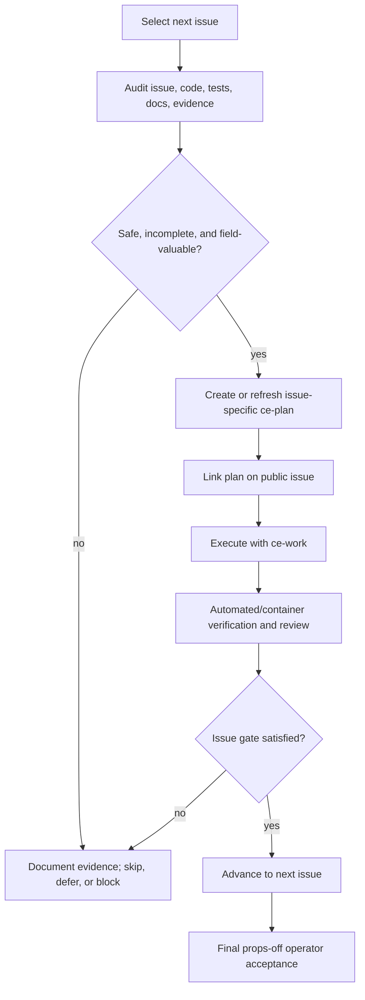

# Operator-Facing Issue Delivery Sequence - Plan

## Goal Capsule

- **Objective:** Deliver the currently prioritized Edge capabilities as a coherent, low-friction operator workflow, without regressing the direct Android-to-ROS transport that is already functioning.
- **Means:** Audit each public issue against the current code and evidence, plan the remaining work specifically, execute only changes that are safe and valuable in the field, then verify before advancing in dependency order. (KTD1, KTD2)
- **Authority:** The public issue is the work boundary. Existing hardware behavior, frozen Android ports/RTP contract, manual-flight boundary, map privacy, KISS architecture, low latency, and reliability take precedence over issue completion pressure.
- **Tail owner:** The operator performs one integrated props-off hardware test after all three implementation issues pass their automated and container-level gates.

---

## Product Contract

### Summary

This plan delivers frame-accurate map/video context first, then an RViz startup experience that presents that correct context, then safe local dashboard configuration and restart controls.
Each issue is independently re-audited before work starts so already-complete behavior is not duplicated and no apparently useful change is allowed to break transport, preview, mapping, or operator safety.

### Problem Frame

The current public backlog has three useful but interdependent operator-facing issues.
Implementing them as isolated feature requests risks building a polished RViz view over temporally incorrect data, or exposing dashboard controls before the complete runtime configuration is known.
The delivery process must make actual field value and safe regression avoidance explicit gates, rather than assuming every open issue remains appropriate to implement unchanged.

### Requirements

**Issue lifecycle**

- R1. Before every issue, inspect its current public description, linked plan, code, tests, documentation, working-tree state, and relevant latest evidence to classify it as unimplemented, partial, complete, obsolete, or blocked.
- R2. Before implementation, identify the change's impact on direct UDP/RTP ingress, one-decode GStreamer preview, ROS image publication, map/path/TF, dashboard lifecycle, Docker workflow, public-clone privacy, and manual-flight boundaries.
- R3. Skip implementation for an issue that is already proven complete, duplicates current capability, provides no material value to a field operator, or would regress a verified boundary. Record the evidence and reason on the issue instead of forcing a change.
- R4. For work that remains safe and valuable, create or refresh an issue-specific implementation plan with `ce-plan` before code changes, then link that plan by name and public repository path in the issue.
- R5. Execute the approved issue-specific plan with `ce-work`, including its own tests, review, documentation, and clean-up responsibilities. Do not begin the next issue until its non-hardware verification is complete or a genuine blocker is documented.

**Delivery order**

- R6. Complete issue #3 before issue #1 because RViz must visualize a frame-synchronous pose rather than the current latest-telemetry pose.
- R7. Complete issue #1 before issue #2 because dashboard configuration/restart controls must operate the settled launch/RViz/runtime shape, not a transitional one.
- R8. Defer the one integrated props-off tablet/drone acceptance run until all three issue implementations are ready. Do not claim hardware completion or close hardware acceptance solely from build, synthetic, or container evidence.

**Architecture and operator value**

- R9. Every issue plan preserves the two-package ROS workspace, direct Android UDP/RTP ingress, frozen ports/payload type, one decode per feed, bounded latest-frame behavior, local-only dashboard, ignored site map/calibration, and no automatic flight/gimbal/mission actions.
- R10. A change is valuable only if it reduces operator friction, makes field state more truthful/actionable, or provides the trustworthy temporal/map context required for downstream detections. Nice-to-have refactors and speculative controls are deferred.

### Key Decisions

- **Frame accuracy before visualization polish** (session-settled: user-directed — chosen over starting with RViz/dashboard convenience: the map position must be correct for the image before improving how it is displayed). Governs R6, R10.
- **One final integrated hardware test** (session-settled: user-directed — chosen over requiring a new tablet/drone test after every issue: the operator will test the completed stack once after all three are ready). Governs R8.

### Key Flows

- F1. **Per-issue decision gate:** Read current issue and code state → compare against the issue's plan and evidence → stop/record if complete, unsafe, or low-value → otherwise plan the remaining change.
- F2. **Per-issue delivery loop:** Link the issue-specific plan publicly → execute with `ce-work` → complete automated/container verification and review → report evidence on the issue → advance only when its remaining dependency is hardware proof.
- F3. **Final operator acceptance:** All three issues are implementation-ready → operator runs one props-off integrated session → evidence determines close, follow-up, or hardware-blocked status for each issue.

### Success Criteria

- Each issue has a visible current-state decision and, when work proceeds, a public linked plan before implementation begins.
- No issue advances due only to checklist pressure; it either adds demonstrated field value or is explicitly skipped/deferred with evidence.
- The final operator test can exercise synchronized map/video, RViz launch, dashboard configuration, and both video feeds from one known build.

### Scope Boundaries

- In scope: public issues #3, #1, and #2; their specific plans, implementation, code review, documentation, issue updates, and final integrated test preparation.
- Out of scope: object detection, segmentation, camera ray-casting, flight commands, replacing the Android transport, changing frozen ports/RTP payload type, exposing private map/calibration, and unrelated cleanup.
- **Deferred to Follow-Up Work:** Any finding that requires a third package, new video transport, protocol rewrite, calibration model, or a flight-operation decision is a new scoped issue rather than an expansion of this delivery sequence.

---

## Planning Contract

### Key Technical Decisions

- KTD1. **Use issue-by-issue evidence gates.** Re-audit the live repository and issue immediately before each implementation cycle because previous plans and hardware state may have drifted. A partial implementation is completed only for the remaining accepted behavior; a proven complete item is documented rather than rewritten. Governs R1-R5.
- KTD2. **Use two planning layers, not one generic implementation pass.** This sequence plan owns order, safety gates, and final acceptance. Each issue owns a refreshed `ce-plan` artifact that defines its exact remaining change before `ce-work` executes it. Governs R4-R7.
- KTD3. **Treat field-operator value as an acceptance gate.** A control, display, or abstraction must make operation safer, clearer, or materially easier. Code that only increases surface area is deferred even if it could technically satisfy issue wording. Governs R3, R9, R10.
- KTD4. **Preserve a single final hardware boundary.** Synthetic, unit, container, and UI configuration tests happen in each issue cycle. Tablet/drone evidence remains a single integrated props-off session after the implementation sequence. Governs R5, R8.

### High-Level Technical Design

### Issue Order and Existing Plans

| Order | Issue | Why it precedes the next item | Plan state at sequence start |
| --- | --- | --- | --- |
| 1 | [#3 Frame-accurate video-navigation context](https://github.com/psampaioc/dji-transport-edge/issues/3) | Establishes the truthful frame/pose relationship required by an RViz visual view and downstream detection. | Existing public plan: `docs/plans/2026-09-04-0500-feat-frame-accurate-georeferencing-plan.md`. Refresh only if audit finds drift. |
| 2 | [#1 RViz bringup and Primary camera](https://github.com/psampaioc/dji-transport-edge/issues/1) | Presents the synchronized map/video state to the operator after #3 defines it. | No implementation plan yet; create after its audit. |
| 3 | [#2 Dashboard local configuration and restart](https://github.com/psampaioc/dji-transport-edge/issues/2) | Controls the settled runtime shape after synchronization and launch behavior are known. | No implementation plan yet; create after its audit. |

### Per-Issue Preflight Gate

For each issue, in the stated order:

1. Read the current issue body/comments and every linked plan.
2. Inspect the current source, tests, documentation, branch/worktree status, container configuration, and most recent relevant evidence.
3. Classify the issue as complete, partial, unimplemented, obsolete, or externally blocked. State the evidence in an issue comment.
4. Map impact against the boundaries in R2 and decide whether the remaining work is safe and genuinely valuable to a field operator.
5. If the decision is complete, unsafe, obsolete, or low-value, do not implement. Document the reason, leave the issue appropriately open/blocked/closed only with evidence, and advance according to the dependency order.
6. If the decision is safe and valuable, create or refresh the issue-specific `ce-plan` plan. Publish the plan when safe for the public repository and add its filename/link in the issue before invoking `ce-work`.
7. Execute that plan with `ce-work`, then report non-hardware verification and any residual final-hardware requirement on the issue.

### Dependencies and Risks

- #3 depends on Android continuing to emit AU identity and Android monotonic timing; Android source-timestamp semantics remain evidence-gated.
- The delivered Edge contract keeps Android/DJI source timestamps separate from ROS delivery headers and Edge observations. Any future detection or map consumer must pair an image with `FrameContext`; it must not infer source timing from `Header.stamp`.
- #1 depends on #3 publishing the frame-synchronous pose/context it must show, while retaining a headless launch mode for test environments.
- #2 depends on the finalized set of safe runtime controls after #1; its restart design must avoid duplicate processes and never expose transport ports or arbitrary shell/filesystem actions.
- Any hardware absence is not permission to simulate success. It leaves the final integrated test pending rather than blocking safe code/test work.

---

## Implementation Units

### U1. Deliver issue #3 frame-accurate context

- **Goal:** Complete the source-time-preserving frame/navigation association before any operator-facing visualization changes depend on it.
- **Requirements:** R1-R5, R6, R8-R10.
- **Dependencies:** None.
- **Files:** Existing plan `docs/plans/2026-09-04-0500-feat-frame-accurate-georeferencing-plan.md`; exact code/test files are revalidated by its preflight and refreshed plan if needed.
- **Approach:** Run the Per-Issue Preflight Gate for #3. Reuse its published plan only if it still matches code and Android contract; otherwise update it before `ce-work`. Preserve source timestamps, bounded correlation, and fail-closed geographic association.
- **Test scenarios:**
  - Audit distinguishes current `video_au` evidence-only handling from actual image/context correlation.
  - Issue-specific tests cover deterministic time selection, missing/late metadata, RTP-to-frame matching, and source/Edge timing separation.
  - Container verification proves unchanged direct ingress, one-decode behavior, map privacy, and clean shutdown.
- **Verification:** Issue #3 contains a plan link, implementation evidence, automated/container results, and an explicit final props-off requirement rather than an unsubstantiated hardware claim.

### U2. Deliver issue #1 RViz startup experience

- **Goal:** Give the operator one supported launch that opens the map/path/current-frame view and Primary image without adding video processing or hiding headless operation.
- **Requirements:** R1-R5, R7-R10.
- **Dependencies:** U1.
- **Files:** Issue-specific plan created after #1 preflight; exact files are decided there.
- **Approach:** Audit the post-#3 launch and RViz state first. Only then create a dedicated #1 plan, link it on the issue, and execute it with `ce-work`. The plan must consume existing ROS topics and distinguish continuous path from frame-synchronous pose.
- **Test scenarios:**
  - Existing RViz configuration and launch files are classified as complete/partial/missing before modification.
  - RViz launch is opt-in or explicit and headless bringup remains usable in Docker tests.
  - Primary image appears through the existing ROS image topic without a new decoder, queue, or relay.
  - Public clone with no local map config degrades clearly without breaking driver/dashboard startup.
- **Verification:** Issue #1 documents the exact non-hardware launch proof and retains a final integrated props-off visual check.

### U3. Deliver issue #2 dashboard configuration and restart

- **Goal:** Let an operator safely persist the small set of local runtime controls that are now settled, then restart the managed Edge application without terminal-heavy workflows or duplicate processes.
- **Requirements:** R1-R5, R7-R10.
- **Dependencies:** U1, U2.
- **Files:** Issue-specific plan created after #2 preflight; exact files are decided there.
- **Approach:** Audit the resulting dashboard/runtime configuration shape after #1. Plan only validated local controls that reduce operator friction, retain immutable Android transport parameters, and preserve public/private configuration separation. Link the plan before `ce-work`.
- **Test scenarios:**
  - Current dashboard controls/configuration are classified before new persistence is introduced.
  - Valid local changes persist atomically; invalid values leave the active configuration untouched.
  - Restart stops the managed stack once and does not retain dashboard/UDP ports or duplicate processes.
  - Frozen ports/RTP assumptions, map paths, flight controls, and arbitrary shell/file controls remain unavailable to the UI.
- **Verification:** Issue #2 reports automated validation, clear restart state, and a remaining final operator test only where hardware is required.

### U4. Prepare one integrated operator acceptance session

- **Goal:** Hand the operator one concise props-off test procedure covering all delivered capabilities from one build/session.
- **Requirements:** R5, R8-R10.
- **Dependencies:** U1, U2, U3.
- **Files:** `README.md`, issue comments for #1-#3, and any issue-specific operational documentation identified by their plans.
- **Approach:** Consolidate only the verified startup, observation, evidence collection, and clean-stop steps. Keep expected results separate from hardware claims. Do not add a separate test application or change the Android transport.
- **Test scenarios:**
  - The procedure identifies the expected frame-context state, RViz view, dashboard state, Primary/FPV behavior, RTK/GPS fallback, evidence location, and clean shutdown.
  - A missing FPV/RTK or unavailable clock has an explicit expected diagnostic outcome instead of a false pass.
- **Verification:** The operator can run one props-off session and attach the resulting evidence to all applicable issues for closure or follow-up.

---

## Verification Contract

| Gate | Applies to | Proof |
| --- | --- | --- |
| Current-state audit | U1-U3 | Issue comment identifies implementation status, relevant evidence, impact assessment, and proceed/skip decision before code changes. |
| Issue-specific plan | U1-U3 | A current `ce-plan` artifact is publicly linked in the issue before `ce-work` begins; #3 reuses its existing plan only after drift review. |
| Issue-specific delivery | U1-U3 | `ce-work` completes the plan's required tests, documentation, review, and cleanup without widening past the issue boundary. |
| Regression boundary | U1-U3 | Dockerized build/tests retain two packages, direct ports, map privacy, one decode per feed, bounded queues, and manual-flight safety. |
| Operator-value gate | U1-U3 | Each delivered change has a concise operator-visible benefit; otherwise it is deferred with a reason. |
| Final hardware acceptance | U4 | One props-off integrated session captures evidence for video/context, RViz, dashboard/restart, navigation source, and both feeds where available. |

---

## Definition of Done

- Issues #3, #1, and #2 were processed in that order through the Per-Issue Preflight Gate.
- Each issue either has evidence-backed implementation completion, an evidence-backed skip/defer/block decision, or an explicitly recorded external dependency; none is silently abandoned.
- Every issue implemented has a named public plan linked from its issue before execution and an evidence summary after execution.
- The resulting Edge workspace remains KISS: two ROS packages, direct Android ingress, one decode per feed, bounded correlation/buffers, and no extra relay or unsafe control surface.
- Automated/container evidence is complete before the final operator test, but does not replace it.
- The final documentation enables one props-off integrated operator test, after which each issue can be closed or receive a precise hardware follow-up.
