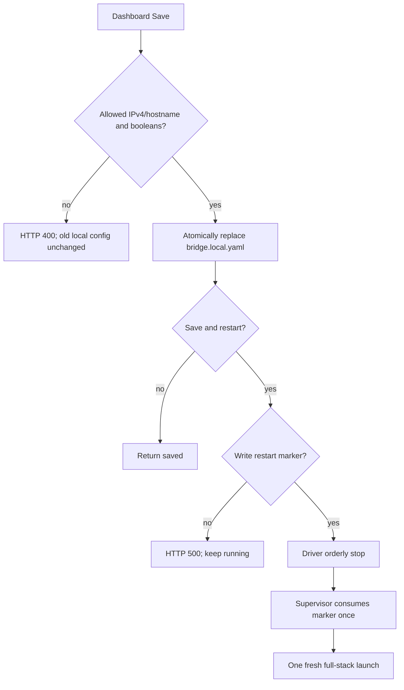

# Edge Reliability and Privacy Hardening - Plan

## Goal Capsule

- **Objective:** An operator can start and configure the Edge stack without risking private map publication, losing the direct video/ROS transport because of a dashboard problem, or receiving a misleading success result for an unusable clock target.
- **Means:** Remove private map assets from version control and installed public artifacts; harden the local dashboard/configuration boundary; characterize the managed-restart lifecycle; and make source-time versus ROS delivery-time use explicit. (KTD1-KTD5)
- **Authority:** Preserve the two-package Humble workspace, direct Android UDP/RTP ingress, frozen ports and RTP PT, one decode per feed, bounded latest-frame behavior, and manual-flight boundary. Android is an external wire-contract owner and is out of scope for edits.
- **Stop condition:** Do not add a package, relay, decoder, database, background service, generic config editor, external dependency, or automatic DJI action.

---

## Product Contract

### Summary

The current Edge implementation is structurally sound but has reliability gaps at its operator boundaries: tracked private map assets, acceptance of an IPv6 clock target by an IPv4-only sender, unclear filesystem-save failures, dashboard port failures that can stop the driver, and insufficient proof of restart behavior. This plan resolves those gaps while keeping direct ingress and low-latency video unchanged.

### Problem Frame

The operator workflow relies on one local container command, dashboard configuration, RViz, and optional packet capture. A configuration/UI failure must not silently create a bad runtime state or take down video and ROS publication. Separately, a map/calibration file is private by design; a Git ignore rule cannot protect it once it remains tracked or gets copied into an installed package.

### Requirements

- R1. Private site-map and calibration files are removed from Git tracking and excluded from installed/public package artifacts, while an operator's ignored local map configuration still enables the local mapper.
- R2. `android_clock_host` accepts only an IPv4 literal or syntactically valid hostname; an IPv6 literal is rejected before any local configuration write or restart request.
- R3. A hostname is resolved and sent through an IPv4 UDP path only. Resolution/send failure is reported as a clock diagnostic and never crashes the driver.
- R4. Dashboard configuration writes report a structured HTTP error for filesystem or marker-write failure. A failed write leaves the previous local configuration unchanged; a failed restart-marker write does not request shutdown.
- R5. Failure to bind the loopback dashboard port is non-fatal to direct UDP/RTP, ROS publication, map/localization, and clean shutdown. The terminal must state why the dashboard is unavailable.
- R6. Save and restart coalesces requests into one managed relaunch; normal Exit and ordinary launch failure do not create a restart. The supervisor behavior has executable coverage.
- R7. Android/DJI source timestamps remain canonical for frame association. ROS `Header.stamp` remains delivery bookkeeping only and no driver/mapper code may use it as a source-time correlation key.
- R8. All fixes retain the existing direct ports (5500/5501/5502/5600/5610), RTP PT 96, one GStreamer decode per feed, local-only dashboard, and no flight-control surface.
- R9. Documentation distinguishes completed container proof from the remaining props-off Android/FPV/RTP-to-decoded-frame acceptance evidence.

### Key Decisions

- **Keep map files local rather than inventing a map service** (session-settled: user-directed). Git tracking and package installation are both removed; an ignored local config remains the explicit opt-in. Governs R1.
- **Constrain clock configuration to the protocol actually supported**. The existing Edge pinger is IPv4 UDP, so rejecting IPv6 is safer and simpler than adding dual-stack behavior. Governs R2-R3.
- **Fail the dashboard soft, fail configuration loudly.** Dashboard availability is valuable but cannot be allowed to stop direct transport; an invalid or unwritable configuration must return an explicit error and never trigger restart. Governs R4-R5.
- **Retain ROS delivery headers without treating them as capture time.** Android/DJI fields in `FrameContext` are the only frame-source identity; no cross-clock conversion or extra synchronization layer is added. Governs R7.

### Key Flows

### Scope Boundaries

- In scope: Edge repository privacy cleanup, dashboard/configuration/restart robustness, source-time contract guardrails, tests, and operator documentation.
- Out of scope: Android SDK changes, video codec or RTP changes, adding IPv6 transport, changing dashboard controls, map calibration, detection, ray-casting, or aircraft operations.
- **Deferred to Follow-Up Work:** Actual Primary/FPV Android props-off correlation evidence and any decision to support IPv6 in the Android/Edge clock protocol.

---

## Planning Contract

### Key Technical Decisions

- KTD1. Install only public mapper configuration assets explicitly. `mapper.local.yaml`, PCD, and calibration stay under the source workspace and are never copied by a broad `install(DIRECTORY config/)` rule.
- KTD2. Use the existing standard library only. Extend validation with IPv4-only literal handling, resolve hostnames through `AF_INET`, and expose error state via the existing dashboard/diagnostic mechanisms.
- KTD3. Treat the dashboard as an optional loopback observer. On port bind failure, record/log the failure and continue the driver; do not choose an automatic alternate port because the documented operator URL must remain deterministic.
- KTD4. Keep restart as an exact file marker consumed by the package-owned supervisor. Add a narrow test seam for its workspace path only if required to test it without a real ROS launch; do not turn it into generic process control.
- KTD5. Do not translate Android monotonic time into ROS time. Preserve the current delivery headers for ROS/RViz compatibility and add contract tests/docs that prevent consumers from using them as source-time identity.

### System-Wide Impact

The changes affect operator startup, public repository hygiene, ROS package installation, and the contract consumed by future detection code. They must be validated in the existing Humble container. No Android artifact or live DJI action is part of this work.

### Sequencing

1. Remove the private map leak before any future commit/push can carry it forward.
2. Harden the configuration/dashboard failure boundary before relying on its restart control.
3. Characterize the supervisor after its requested-state behavior is finalized.
4. Lock down source-time semantics and then update the operator guide and final non-hardware gates.

---

## Implementation Units

### U1. Make mapper assets public-safe and locally opt-in

- **Goal:** Ensure the repository and installed ROS package contain no site-specific PCD or calibration while preserving a local operator map workflow.
- **Requirements:** R1, R8.
- **Dependencies:** None.
- **Files:** `.gitignore`, `src/dji_edge_mapper/CMakeLists.txt`, `src/dji_edge_mapper/launch/dji_edge_mapper.launch.py`, `src/dji_edge_mapper/config/mapper.yaml`, `src/dji_edge_mapper/config/mapper.local.yaml.example`, `README.md`, mapper package tests as needed.
- **Approach:**
  1. Remove `map_vis.pcd` and `map_metadata.json` from the Git index without deleting the operator's local copies; retain their ignore rules.
  2. Replace broad mapper-config installation with an explicit public allowlist so local PCD/calibration cannot be included in `install/` by accident.
  3. Make the launch resolve an ignored source-workspace `mapper.local.yaml` only when present; otherwise use the installed disabled public defaults.
  4. Keep the example generic and document where the operator places local map assets and calibration.
- **Patterns to follow:** Existing disabled public defaults in `src/dji_edge_mapper/config/mapper.yaml` and explicit local-config preference in `src/dji_edge_driver/launch/dji_edge_bringup.launch.py`.
- **Test scenarios:**
  - A clean checkout/package install contains public YAML and the generic example but no PCD or map metadata.
  - An ignored local mapper config is preferred locally and enables the existing mapper path.
  - With no local mapper config, driver/dashboard start and mapper remains intentionally disabled.
- **Verification:** `git ls-files` has no private map/calibration paths; installed package inspection and headless Humble smoke confirm the public-clone behavior.

### U2. Harden clock-target validation and dashboard failure reporting

- **Goal:** Prevent unusable clock targets and give an operator deterministic, non-destructive error feedback when saving fails.
- **Requirements:** R2, R3, R4, R8.
- **Dependencies:** U1, to resolve repository privacy before testing the remaining local runtime work.
- **Files:** `src/dji_edge_driver/dji_edge_transport_core/local_config.py`, `src/dji_edge_driver/dji_edge_transport_core/dashboard.py`, `src/dji_edge_driver/scripts/dji_edge_driver_node.py`, `src/dji_edge_driver/test/test_transport_core.py`, `README.md`.
- **Approach:**
  1. Reject IPv6 literals while retaining empty, IPv4, and hostname input validation.
  2. Resolve hostname clock targets using IPv4 socket resolution only; keep failure as an observable diagnostic rather than a driver exception.
  3. Convert filesystem/marker failures into bounded HTTP error responses, keeping the prior configuration file and runtime alive.
  4. Only set `stop_requested` after both a valid config write and a successful restart-marker write.
- **Execution note:** Start with characterization tests for current accepted inputs and then add failure-path coverage before changing the callback path.
- **Patterns to follow:** Existing strict `ALLOWED_KEYS`, `atomic_write`, and dashboard callback injection in `test_transport_core.py`.
- **Test scenarios:**
  - IPv4, valid hostname, and blank target validate; IPv6 literal, invalid hostname, non-boolean values, and extra keys fail.
  - A hostname with no IPv4 answer leaves a clock diagnostic and does not terminate the node.
  - A simulated `os.replace` failure preserves prior config bytes and returns an HTTP error.
  - A simulated restart-marker write failure reports that restart was not requested and leaves `stop_requested` clear.
  - An ordinary valid Save persists but does not stop the node; Save and restart returns the explicit restarting state only after the marker exists.
- **Verification:** The dashboard API tests cover success, validation errors, configuration I/O errors, and marker errors; no test requires a tablet or browser.

### U3. Make the dashboard optional without weakening transport

- **Goal:** A busy dashboard port no longer prevents the direct driver, mapper, and video pipeline from running.
- **Requirements:** R5, R8.
- **Dependencies:** U2, because dashboard state/error representation is shared.
- **Files:** `src/dji_edge_driver/scripts/dji_edge_driver_node.py`, `src/dji_edge_driver/test/test_transport_core.py`, `README.md`.
- **Approach:**
  1. Catch dashboard bind/start failure at the driver boundary.
  2. Store a clear dashboard-specific error for diagnostics/state and log one actionable terminal message.
  3. Continue all UDP endpoints, video feeds, ROS publishers, evidence, and shutdown behavior unchanged.
  4. Do not auto-select a different port or expose a dashboard host/port editor.
- **Patterns to follow:** `endpoint_errors` and the existing optional `dashboard_enabled` parameter.
- **Test scenarios:**
  - Occupying the configured loopback port makes dashboard creation fail soft while a constructed driver can continue its non-dashboard initialization path.
  - Dashboard-disabled behavior remains unchanged.
  - A successful bind still exposes `/v1/state`, `/v1/config`, and Exit.
- **Verification:** A headless Humble smoke with an intentionally occupied 8090 proves ROS driver/mapper survive and report the dashboard condition.

### U4. Characterize and harden managed restart semantics

- **Goal:** Exactly one requested restart occurs, while normal Exit and unrequested process termination remain terminal.
- **Requirements:** R4, R5, R6, R8.
- **Dependencies:** U2 and U3.
- **Files:** `src/dji_edge_driver/scripts/dji_edge_bringup.sh`, `src/dji_edge_driver/test/test_dji_edge_bringup_supervisor.py` (new), `src/dji_edge_driver/CMakeLists.txt`, `README.md`.
- **Approach:**
  1. Preserve the current marker model and remove the marker before relaunch.
  2. Introduce only the smallest testable workspace/launcher indirection necessary for an isolated fake-ROS supervisor test; defaults remain `/workspace` and `ros2 launch`.
  3. Ensure the test never starts ROS, GStreamer, a browser, or a DJI service.
- **Test scenarios:**
  - A successful child exit without marker exits once.
  - A child exit with one pre-existing requested marker consumes it and launches exactly one additional time.
  - A normal Exit path with no marker does not relaunch.
  - A child failure with no marker preserves its non-zero exit code.
  - A stale marker is consumed once rather than producing an unbounded loop.
- **Verification:** Shell syntax check and isolated supervisor test pass in the Humble container; a headless real launch still performs clean shutdown.

### U5. Guard the frame source-time contract and update acceptance evidence

- **Goal:** Future detection/map consumers cannot mistake ROS delivery time for Android/DJI source timing, and the remaining hardware gate is accurately documented.
- **Requirements:** R7, R9.
- **Dependencies:** U1-U4.
- **Files:** `src/dji_edge_driver/msg/FrameContext.msg`, `src/dji_edge_driver/msg/NavigationState.msg`, `src/dji_edge_driver/scripts/dji_edge_driver_node.py`, `src/dji_edge_mapper/scripts/drone_localization_node.py`, `src/dji_edge_driver/test/test_transport_core.py`, `README.md`, `docs/plans/2026-09-04-0507-feat-issue-delivery-sequence-plan.md`.
- **Approach:**
  1. Preserve source-time fields and their separate Edge diagnostics exactly as they are; do not introduce cross-clock conversion, a queue, or a new topic.
  2. Add contract-level tests/comments showing frame association derives only from AU identity plus Android monotonic fields, never ROS header stamp or Edge decode time.
  3. Clarify in the topic inventory and final props-off guide that ROS headers provide delivery/RViz bookkeeping and `FrameContext` is mandatory for source-time georeferencing.
  4. Keep the actual Android RTP-to-decoded-frame proof as the explicit final props-off acceptance gate.
- **Patterns to follow:** `FrameContext.msg` source-versus-observation comments and `LatestState.associate_frame` source-time correlation.
- **Test scenarios:**
  - Changing a ROS delivery header does not alter selected frame navigation.
  - Missing/ambiguous AU identity yields unavailable context rather than fallback-to-latest telemetry.
  - Android AU timestamps and optional DJI source timestamp remain unchanged in FrameContext and NDJSON source fields.
- **Verification:** Unit coverage demonstrates the contract; documentation names the unresolved hardware proof rather than claiming it from synthetic/container output.

---

## Verification Contract

- Build and test only in the existing project Humble Docker runtime. Run both packages' Release build, all tests, verbose test results, and shell syntax validation.
- Add tests before or alongside each changed failure boundary; do not rely only on string-inspection launch tests for new behavior.
- Run headless bringup with `rviz:=false preview_windows:=false` after U1-U4 and assert clean startup/shutdown with the dashboard available and unavailable cases.
- Inspect Git tracking and installed package contents after U1; private map files must be absent from both.
- Run the existing props-off acceptance only when the tablet/drone are available. Required evidence remains: Primary/FPV ingress, Android `video_au` to decoded frame association, frame context, RTK/GPS fallback, gimbal pitch, dashboard Save/restart, one process stack, and clean Exit.

---

## Risks and Mitigations

- **Local map availability changes after installation cleanup:** prefer the ignored source-workspace local config explicitly; verify both public and local launch paths before declaring success.
- **Dashboard is unavailable after a port collision:** keep transport running and log the exact loopback URL/port error; the operator can resolve the conflict and restart intentionally.
- **DNS hostname behavior differs by network:** do not promise dual-stack support. Limit runtime resolution to IPv4 and surface a clock diagnostic if it cannot resolve.
- **Hardware proof remains unavailable:** leave issue acceptance open; do not infer FPV or real Android PTS behavior from unit tests.

---

## Definition of Done

- Private PCD/calibration files are absent from Git tracking and installed/public artifacts, while ignored local mapper configuration remains supported.
- Dashboard configuration rejects unsupported clock addresses, reports write failures clearly, and never requests restart after an incomplete save/restart transaction.
- Dashboard port collision leaves direct Edge transport, ROS, evidence, and clean shutdown operational.
- Managed restart behavior is covered by an executable isolated test and produces at most one intentional relaunch.
- Frame source-time consumers have an explicit and tested contract: source fields from Android/DJI, delivery bookkeeping from ROS/Edge, no substitution.
- Humble build/test/smoke gates pass; the props-off acceptance remains a separately recorded hardware gate, not a simulated claim.
- No Android SDK file, Android wire port, RTP payload contract, flight action, third package, relay, or second decoder is added.
