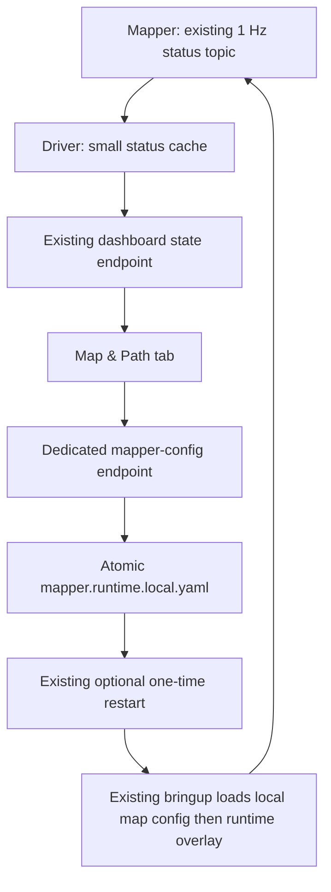

# Dashboard Map and Path Controls - Plan

## Goal Capsule

- **Objective:** Let an Edge operator inspect trajectory health and safely choose the visible-path spacing and retention policy from the local dashboard.
- **Means:** Add a narrow mapper-runtime overlay, reuse the mapper's existing one-hertz status topic, and extend the current local-only dashboard and managed-restart path.
- **Authority:** The two-package direct Android UDP/RTP architecture, existing map calibration, source-time contract, fixed transport ports, and native preview pipeline remain unchanged.
- **Stop condition:** Do not add a video/RTP callback, a decoder, a relay, a new timer or status publisher in the mapper, arbitrary YAML editing, map-path controls, or flight controls.

---

## Product Contract

### Summary

This plan adds a Map & Path dashboard tab for the controls and status that matter during a mapped mission, without placing dashboard work in the Android-to-ROS video or telemetry hot paths.

### Problem Frame

The configured RViz view already renders `/dji/navigation/path` as a visible billboard line, but its trajectory spacing and 5,000-pose retention limit require a file edit and are not visible to an operator who is monitoring the transport dashboard.

The map/calibration configuration is private, site-specific, and must remain separate from ordinary field controls.

### Requirements

**Safe path controls**

- R1. The dashboard provides a distinct Map & Path tab with `min_path_spacing_m` and a choice between a finite `max_history_points` value and full-route retention (`0`).
- R2. Only the two path parameters are writable from the dashboard; map file paths, map metadata, UTM settings, bounds/jump gates, topics, ports, RTP, and all flight controls remain unavailable.
- R3. The values persist in an ignored, atomic mapper runtime overlay which is applied after the operator's existing `mapper.local.yaml` and never rewrites it.
- R4. Save records settings for the next launch; Save and restart uses the existing single managed-restart mechanism and applies them to the relaunched mapper.

**Operator status**

- R5. The tab shows the mapper's existing compact status: path poses, accepted navigation samples, RTK and GPS-fallback counts, rejection counts, and frame-context association counts.
- R6. The dashboard marks unavailable, malformed, or stale mapper status rather than inferring that localization is healthy.

**Performance and reliability**

- R7. No video/RTP ingest callback, GStreamer pipeline, decode path, Android wire contract, or mapper publication cadence changes.
- R8. The only new observation is a driver subscription to the mapper's already-existing `/dji/navigation/status` at its existing 1 Hz cadence; it only caches a small JSON object for HTTP reads and must never block ingress or trigger a restart.

### Success Criteria

- The operator can choose full-route retention or a bounded history, save it, and see the exact active/pending values.
- A dashboard restart preserves the private map configuration and launches mapper with the selected overlay values.
- The video and UDP path retain their current architecture and behavior; non-hardware verification covers the new boundary and actual field proof remains a props-off test.

### Scope Boundaries

- The dashboard remains loopback-only and dependency-free.
- RViz styling remains unchanged: `/dji/navigation/path` stays a cyan `Billboards` path; this work exposes its data-retention policy, not a second viewer.
- The current path's local map frame, RTK-first/GPS-fallback behavior, and frame-synchronous `/dji/frame/pose` remain unchanged.

#### Deferred to Follow-Up Work

- Live editing of map/calibration/UTM safety parameters.
- Exporting a mission-completeness report or comparing planned mission waypoints against the path.
- Replacing the dashboard's embedded page with a separate frontend.

---

## Planning Contract

### Key Technical Decisions

- KTD1. **Use a generated mapper runtime overlay.** (session-settled: user-approved — chosen over exposing the whole mapper configuration: field controls must not overwrite private calibration or add operational complexity.) Create an ignored `mapper.runtime.local.yaml` containing only the two path parameters, and load it after `mapper.local.yaml`. This preserves the map asset and calibration file as operator-managed site configuration.
- KTD2. **Reuse the existing mapper status publication.** (session-settled: user-approved — chosen over new dashboard-specific telemetry or high-rate callbacks: the dashboard must be KISS and must not affect latency.) The driver holds the most recent valid `/dji/navigation/status` JSON status received at the mapper's existing 1 Hz cadence. The subscription is observation-only, bounded, and outside all UDP/RTP and GStreamer callbacks.
- KTD3. **Apply changes through the current restart supervisor.** Save is intentionally non-disruptive; Save and restart writes the overlay atomically, requests the existing one-time supervisor restart, and relies on launch ordering to load the overlay. No dashboard route may launch ROS, RViz, GStreamer, or a container itself.
- KTD4. **Expose full-route retention explicitly.** The UI represents `max_history_points == 0` as “Keep full route” and presents the finite-point field only when that option is off. It warns that unlimited history grows with mission duration rather than silently imposing a different cap.

### High-Level Technical Design

This is directional design, not implementation code.

The normal data plane stays separate:

### Execution Direction

Use characterization-first tests around the existing local configuration and managed-restart behavior before extending them, then run the project Humble Docker build/test suite and a headless bringup smoke. Hardware visual proof stays separate.

---

## Implementation Units

### U1. Add the isolated mapper runtime configuration boundary

- **Goal:** Define strict, atomic persistence and validation for only `min_path_spacing_m` and `max_history_points`.
- **Files:** `src/dji_edge_driver/dji_edge_transport_core/mapper_config.py`, `src/dji_edge_driver/test/test_transport_core.py`, `.gitignore`.
- **Approach:** Model this boundary separately from `local_config.py`; accept finite non-negative spacing and a non-negative integer history limit, serialize a minimal ROS parameter overlay for `drone_localization_node`, and reuse the existing restart-marker ordering only after a successful atomic write.
- **Test scenarios:** A valid finite configuration serializes only the allowed mapper keys; `0` survives as unlimited history; negative, non-finite, fractional-history, extra-key, and atomic-write failures leave the previous overlay unchanged; restart-marker failure does not stop the current stack.
- **Verification:** The test proves a private `mapper.local.yaml` is neither read nor rewritten by this boundary.

### U2. Load the runtime overlay without altering map setup

- **Goal:** Make a successful restart apply dashboard path controls while preserving the existing local/private mapper configuration selection.
- **Files:** `src/dji_edge_driver/launch/dji_edge_bringup.launch.py`, `src/dji_edge_mapper/launch/dji_edge_mapper.launch.py`, `src/dji_edge_driver/test/test_bringup_launch.py`, `src/dji_edge_mapper/test/test_public_install_layout.py` where appropriate.
- **Approach:** Extend the launch parameter composition so the public/default or optional `mapper.local.yaml` is loaded first and the optional runtime overlay is loaded second. Absence of the overlay must preserve today's launch description and public-clone behavior.
- **Test scenarios:** No overlay produces the current mapper parameter source; a local map config plus overlay appears in that order; overlay does not introduce map file metadata into the installed public layout; headless RViz-disabled launch remains declared correctly.
- **Verification:** The loaded parameter list proves only the two intended runtime values can override mapper settings.

### U3. Cache existing mapper health in the driver dashboard state

- **Goal:** Surface useful trajectory metrics without adding a new mapper timer, publisher, or high-rate data-path callback.
- **Files:** `src/dji_edge_driver/scripts/dji_edge_driver_node.py`, `src/dji_edge_driver/config/bridge.yaml`, `src/dji_edge_driver/test/test_transport_core.py`.
- **Approach:** Declare an immutable `mapper_status_topic` parameter with the existing `/dji/navigation/status` default, subscribe once with compatible reliable/transient QoS, validate bounded JSON into a small latest-value cache, and include cache freshness/error state plus mapper configuration values in `dashboard_state()`. Malformed payloads update an observation error only; they cannot affect ROS ingress, video, or mapper operation.
- **Test scenarios:** A valid status produces the expected compact dashboard section; missing status is unavailable; malformed status is reported without replacing the previous valid snapshot; an old snapshot is marked stale; the callback does not modify driver transport/video counters or request shutdown.
- **Verification:** The resulting state payload remains JSON-serializable and bounded, with no raw map, frame, or RTP payload added.

### U4. Add the Map & Path dashboard tab and safe actions

- **Goal:** Present trajectory health and the two controls clearly alongside the established Transport configuration.
- **Files:** `src/dji_edge_driver/dji_edge_transport_core/dashboard.py`, `src/dji_edge_driver/test/test_transport_core.py`.
- **Approach:** Keep the dependency-free embedded page and one-second refresh. Add a dedicated mapper configuration provider/saver and a dedicated local endpoint; render the Map & Path tab with accepted/rejected and RTK/GPS counts, path poses, frame-context counts, freshness, spacing, finite-history input, and full-route toggle. Reuse the existing Save versus Save and restart semantics and report persisted-but-not-applied state accurately.
- **Test scenarios:** GET returns only safe mapper values and status; POST rejects non-object input, non-boolean restart, out-of-allowlist values, invalid numeric values, and failed persistence; valid Save does not stop the driver; valid Save and restart calls the existing orderly stop path exactly once; the static page contains no controls for map paths, UTM, ports, or RTP.
- **Verification:** HTTP tests and a local browser smoke verify the tab renders when mapper status is unavailable and when it is present.

### U5. Document field behavior and verify the integrated path

- **Goal:** Make the full-route trade-off and dashboard/mapper relationship explicit for the operator.
- **Files:** `README.md`.
- **Approach:** Document `0` as unlimited path history, finite retention as a memory bound, Save versus Save and restart, what status represents, and the intentional exclusion of calibration/map controls. Retain instructions that a public clone requires an operator-created private map configuration.
- **Test scenarios:** Documentation references the actual launch, overlay, topic, and dashboard endpoint names; a fresh public layout remains free of private map assets and generated local overlays.
- **Verification:** Docker Humble build/test and headless bringup smoke pass; a props-off session confirms RViz shows the expected billboard trajectory through the full test route after selecting unlimited retention.

---

## Verification Contract

| Gate | Covers | Proof |
| --- | --- | --- |
| Configuration safety | U1 | Unit tests cover validation, atomic failure, exact overlay contents, and no private mapper-file rewrite. |
| Launch composition | U2 | Launch-description tests prove overlay ordering and no-overlay regression. |
| Observation isolation | U3 | Tests show mapper-status parsing is bounded and cannot mutate ingress/video state or request shutdown. |
| Dashboard API/UI | U4 | Local HTTP tests cover GET/POST errors and save/restart isolation; browser smoke checks both unavailable and valid mapper state. |
| Workspace regression | U1-U5 | Existing ROS 2 Humble Docker build, tests, and headless bringup smoke pass. |
| Hardware boundary | U5 | Props-off test verifies map/path behavior using real Android telemetry; it is not claimed from container tests. |

---

## Definition of Done

- The local dashboard has a Map & Path tab that exposes only safe spacing and retention controls plus mapper health.
- Full-route retention maps exactly to `max_history_points: 0`; finite retention is explicit and persists atomically in a separate ignored overlay.
- Restarting applies the overlay once without overwriting private map/calibration configuration.
- Existing UDP/RTP/GStreamer code, Android contract, map source, RViz billboard styling, and mapper status publication cadence are unchanged.
- Automated Docker/headless checks pass, and real-hardware visual acceptance remains an explicit props-off gate.
