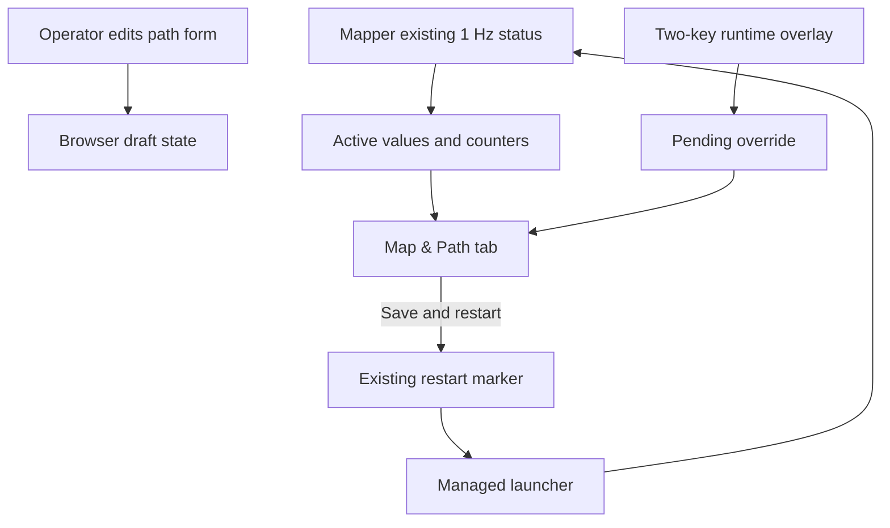

# Dashboard Launcher and Interaction Reliability - Plan

## Goal Capsule

- **Objective:** Let an Edge operator start the managed stack, change path retention safely, and know whether the displayed setting is active or only saved for the next restart.
- **Means:** Repair the installed supervisor command, retain an in-progress dashboard form across metric refreshes, and expose the mapper's effective path values through its existing status message. (KTD1, KTD2)
- **Authority:** The direct Android UDP/RTP architecture, fixed ports, GStreamer pipeline, source-time contract, two-package ROS workspace, private map configuration, and explicit-flight-control boundary remain unchanged.
- **Stop condition:** Do not add video/RTP callbacks, timers, HTTP relay paths, map/calibration/UTM editors, arbitrary YAML editing, flight controls, or Android changes.

---

## Product Contract

### Summary

The correction makes the documented managed launcher executable in the symlink-install development workflow.
It makes Map & Path edits stable while the dashboard continues to refresh health metrics.
It separates the mapper's active values from a saved runtime override that is waiting for restart.

### Problem Frame

The prior dashboard plan implemented a narrow overlay and status tab, but its normal launcher command cannot execute the installed supervisor.
The one-second page refresh also replaces a value while the operator is typing it.
The tab currently cannot prove that default-looking values are the mapper's effective values when a private base configuration exists.

### Requirements

**Managed lifecycle**

- R1. The source and installed supervisor are executable in a `--symlink-install` Humble workspace, and `ros2 run dji_edge_driver dji_edge_bringup` is the stable managed-launch command.
- R2. The documented `djiedge-run` convenience path invokes that managed command, so Save and restart consumes exactly one marker and returns to one replacement stack.
- R3. Direct `ros2 launch` remains available for diagnostics, but documentation states that it does not provide dashboard-managed restart.

**Operator interaction and truthfulness**

- R4. The Map & Path metric refresh continues at one second without replacing a form value that the operator has changed but not saved.
- R5. A successful Save synchronizes the controls to the persisted overlay and marks it pending; a successful Save and restart reports pending until the mapper publishes the replacement stack's effective values.
- R6. The dashboard distinguishes mapper status freshness from path-configuration state. It shows the active `min_path_spacing_m` and `max_history_points` from the mapper, plus a distinct pending override when they differ.
- R7. The tab shows all existing frame-context counters: received, published, rejected, and unavailable.

**Safety and performance**

- R8. Path values remain the only mapper settings writable through the dashboard. Private map, calibration, projection, bounds, topics, ports, RTP, and flight controls remain unavailable.
- R9. Effective path values travel only in the mapper's already-existing compact one-hertz status publication. No mapper timer, publisher, video/RTP callback, decoder, or Android wire contract changes.

### Success Criteria

- `djiedge-run` starts the managed stack from a clean workspace, and dashboard Save and restart yields one clean relaunch.
- An operator can type a spacing or history value for longer than one refresh interval without it being overwritten.
- The tab can show active values, a pending saved override, mapper freshness, and all four frame-context counters without exposing private configuration.

### Scope Boundaries

- The dashboard remains loopback-only and dependency-free.
- The runtime overlay stays a two-key ignored file and continues to load after `mapper.local.yaml`.
- RViz styling, path topic, navigation projection, RTK/GPS choice, and frame-time association remain unchanged.

#### Deferred to Follow-Up Work

- Editing map/calibration/UTM/bounds parameters.
- Persisting dashboard draft values across a browser reload.
- Hardware acceptance beyond the existing props-off checklist.

---

## Planning Contract

### Key Technical Decisions

- KTD1. **Install one stable supervisor executable name.** (session-settled: user-approved — chosen over documenting a shell-script suffix: operator commands must be short and reliable.) Mark the supervisor source executable and install it as `dji_edge_bringup`. This preserves the existing marker loop and lets `ros2 run` discover it. Governs R1, R2, R3.
- KTD2. **Keep dashboard form draft state in the browser.** (session-settled: user-approved — chosen over lowering dashboard refresh frequency: operator edits must not be lost while health remains current.) Refresh metrics and persisted/active state every second, but only hydrate inputs on first load, after a successful save, or when the form is not dirty. Governs R4, R5.
- KTD3. **Report effective path values on the existing mapper status message.** The localizer already publishes this compact one-hertz status. Add two validated read-only fields instead of reading private YAML from the driver or adding a query service. Governs R5, R6, R9.
- KTD4. **Keep active and pending values separate.** The mapper status is the source of active values. The runtime overlay is the source of requested values. The dashboard must not label an override as active before the replacement mapper reports it. Governs R5, R6.

### High-Level Technical Design

The status publisher keeps the same message, topic, QoS, and one-second timer.
Only two small path values join the existing counter object.

### Execution Direction

Use characterization-first tests for the executable install name and supervisor lifecycle.
Then test dashboard state transitions and browser interaction before the Docker build, ROS tests, and a managed-launch smoke.

---

## Implementation Units

### U1. Repair and standardize the managed supervisor command

- **Goal:** Make the documented normal startup path executable and restart-capable in the mounted symlink-install workspace.
- **Requirements:** R1, R2, R3.
- **Files:** `src/dji_edge_driver/scripts/dji_edge_bringup.sh`, `src/dji_edge_driver/CMakeLists.txt`, `src/dji_edge_driver/test/test_dji_edge_bringup_supervisor.py`, `README.md`.
- **Approach:** Preserve the existing supervisor loop. Set the source execute bit and install the program under the extension-free ROS executable name `dji_edge_bringup`. Update operator guidance to use `ros2 run dji_edge_driver dji_edge_bringup`; align the existing user-level `djiedge-run` alias with that command without changing Docker Compose.
- **Test scenarios:** The source program is executable; a symlink-install build exposes `dji_edge_bringup` through `ros2 pkg executables`; the supervisor still relaunches once only when its exact marker exists; normal Exit and an unrequested launch failure remain terminal.
- **Verification:** In the Humble project container, start the managed command headlessly, request restart through the local API fixture, and prove one replacement driver/mapper stack starts. Confirm the direct launch documentation retains its diagnostic-only lifecycle note.

### U2. Publish and cache active mapper path values without a new data path

- **Goal:** Give the dashboard an authoritative read-only view of the mapper's active spacing and retention values.
- **Requirements:** R5, R6, R9.
- **Files:** `src/dji_edge_mapper/scripts/drone_localization_node.py`, `src/dji_edge_driver/dji_edge_transport_core/mapper_status.py`, `src/dji_edge_driver/scripts/dji_edge_driver_node.py`, `src/dji_edge_driver/test/test_transport_core.py`, `src/dji_edge_mapper/test/test_public_install_layout.py` where appropriate.
- **Approach:** Add finite non-negative active spacing and non-negative active history fields to the current status JSON created by `publish_status()`. Extend the bounded cache schema to validate those fields separately from counters. Return active values and the overlay's requested values as distinct dashboard fields. Preserve invalid/stale/unavailable behavior.
- **Test scenarios:** A valid status with active values is accepted; missing, non-finite, negative, fractional-history, or partially-present active values are invalid; invalid input preserves the last valid snapshot; the cache remains bounded; no video, ingress, or restart state changes.
- **Verification:** A driver state snapshot serializes active values, requested overlay values, status age, and pending state without raw frame/RTP/map data.

### U3. Make Map & Path editing stable and expose complete context metrics

- **Goal:** Let the operator edit safely while live status remains current.
- **Requirements:** R4, R5, R6, R7, R8.
- **Files:** `src/dji_edge_driver/dji_edge_transport_core/dashboard.py`, `src/dji_edge_driver/test/test_transport_core.py`, `README.md`.
- **Approach:** Maintain a small dirty flag for the two controls. Poll metrics/status at the existing cadence, but do not hydrate dirty controls. Clear the flag and refresh values only after a successful API save. Render active and pending values separately. Show frame-context received, published, rejected, and unavailable counters. Keep the exact two-key POST allowlist and existing restart route.
- **Test scenarios:** Typing a draft survives more than one refresh interval; toggling full route hides the finite input without losing the draft; Save leaves the driver running and reports pending; Save and restart reports the old active values until the replacement status arrives; unavailable and invalid mapper status remain visible; no map/UTM/port/RTP controls appear.
- **Verification:** Browser smoke against a local stack checks the initial unavailable state, a valid status state, dirty-form preservation, full-route behavior, and no console errors. HTTP tests retain malformed-request and failed-persistence coverage.

### U4. Verify the complete managed operator path and document its limits

- **Goal:** Ensure the corrected startup/restart workflow and documentation agree.
- **Requirements:** R1, R2, R3, R5, R8.
- **Files:** `README.md`, `src/dji_edge_driver/test/test_dji_edge_bringup_supervisor.py`, `src/dji_edge_driver/test/test_transport_core.py`.
- **Approach:** Keep commands centered on the managed ROS executable for normal field use. State that direct launch is useful for diagnostics but cannot consume a dashboard restart marker. Document active versus pending path values and unlimited history without exposing private configuration.
- **Test scenarios:** Documentation names the installed executable and runtime overlay accurately; build/test output proves both ROS packages; a managed headless smoke proves dashboard status and clean shutdown.
- **Verification:** Docker Humble build/test passes, the managed launcher responds on loopback, and no agent container or host port remains after the smoke.

---

## Verification Contract

| Gate | Covers | Proof |
| --- | --- | --- |
| Executable and lifecycle | U1 | Source mode, installed ROS executable discovery, and existing one-marker supervisor tests pass in a symlink-install workspace. |
| Mapper status schema | U2 | Unit tests cover valid active values, malformed values, stale snapshots, and retained last valid status. |
| Dashboard API and interaction | U3 | HTTP tests preserve the two-key boundary; browser smoke proves draft preservation, full-route behavior, state honesty, and no console errors. |
| Workspace regression | U1-U4 | `colcon build --symlink-install --cmake-args -DCMAKE_BUILD_TYPE=Release`, `colcon test`, and `colcon test-result --verbose` pass in the project Humble container. |
| Managed runtime smoke | U1-U4 | The managed executable starts driver, mapper, and dashboard headlessly; a single requested restart occurs; Exit does not restart; ports are released. |
| Hardware boundary | U4 | Existing props-off test verifies actual Android ingress, RViz path growth, Primary/FPV behavior, and dashboard active/pending transition. It is not claimed from local checks. |

## Definition of Done

- The normal `djiedge-run` and manual managed command start an executable supervisor in the symlink-install development workspace.
- Dashboard Save and restart results in one managed replacement stack, while direct launch remains terminal and documented as diagnostic-only.
- A Map & Path draft survives the one-second metric refresh until Save or an intentional reset.
- The tab reports active mapper values separately from a pending two-key overlay and shows all four frame-context counters.
- Existing Android, UDP/RTP, GStreamer, map, calibration, RViz, and flight-safety behavior remains unchanged.
- Docker build, automated tests, managed headless smoke, browser smoke, and cleanup checks pass. Props-off field acceptance remains listed as unproven hardware work.
