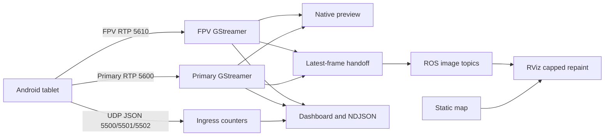

# Edge Idle Runtime and Ingress Diagnosis - Plan

## Goal Capsule

- **Objective:** An operator can leave the Dockerized Edge stack open while waiting for a tablet or drone without making the laptop sluggish, and can immediately distinguish an Android/network ingress absence from a decoder, ROS, RViz, or dashboard failure.
- **Means:** Establish a repeatable component-level baseline, remove only measured idle work from the direct driver, cap the static-map RViz render cost without touching image transport, and expose small per-boundary ingress facts in the existing dashboard/evidence surface. (KTD1-KTD4)
- **Authority:** Preserve the two-package ROS 2 Humble workspace, direct Android UDP/RTP ingress and frozen ports, one GStreamer decode per feed, native Primary/FPV previews, source-time contract, static map/path, NDJSON evidence, and manual-flight boundary.
- **Stop condition:** Do not edit Android code, alter packet formats/ports/RTP payload type, add a relay or a decoder, turn on raw RTP capture by default, add a ROS package, or stop system updates/processes that belong to Ubuntu rather than this project.

---

## Product Contract

### Summary

The current field stack can be correctly launched while no Android datagrams arrive, yet RViz and the driver consume substantial CPU. The operator sees neither image windows nor packets, but needs an evidence-backed answer instead of guessing whether the defect is local decode, ROS, network reachability, or Android transport. The correction keeps the real-time path short and limits only work that is proven unnecessary while idle.

### Problem Frame

The observed runtime had zero telemetry, metadata, Primary RTP, and FPV RTP packets, plus a timed-out clock probe. This proves no ingress at the Edge boundary for that run; it does not implicate GStreamer. At the same time, RViz rendered a one-million-point static map at 30 Hz and the driver ran a 60 Hz publication timer despite having zero decoded frames. System update processes also consumed CPU, but they are outside Edge control.

### Requirements

- R1. The Edge repository must provide a reproducible, bounded resource/ingress characterization that attributes CPU and memory to driver, RViz, mapper, and external host processes without recording video or issuing DJI actions.
- R2. With no incoming video, the driver must not perform high-rate ROS image publication work merely because RViz subscribed; normal active-video latency must remain bounded and the existing latest-frame semantics must remain intact.
- R3. The default RViz configuration must avoid repeatedly rendering the static map faster than is useful to an operator, without reducing RTP ingestion, GStreamer preview cadence, source-time correctness, or ROS video topic semantics.
- R4. Dashboard state and session evidence must report enough post-network ingress facts per telemetry/metadata/Primary/FPV boundary to say whether the Edge has received anything, rejected malformed input, or is waiting for Android/network traffic.
- R5. The operator guidance must separate Edge-controllable recovery from the external tablet prerequisites: correct live tablet IP, Android transport enabled, same reachable network, and a valid ADB path only when tablet inspection is required.
- R6. Existing direct-ingress behavior, map/path behavior, source timestamps, and dashboard configuration controls must remain compatible with the Android wire contract.

### Success Criteria

- In a no-tablet run, dashboard state states plainly that each boundary has received zero packets rather than implying a video or decode fault.
- The measured idle CPU of the driver and RViz is materially lower than the current baseline, with the attribution report showing which Edge component changed; no arbitrary latency target is claimed before an active tablet bench.
- In an active Primary bench, packets, decoded frames, ROS frames, and preview remain live and bounded; any FPV absence is located at a real boundary instead of being inferred.

### Scope Boundaries

- Android transport enablement, Wi-Fi/AP isolation, tablet IP changes, wireless-ADB pairing, and DJI callbacks are external prerequisites. This plan can report their absence but cannot force them remotely when ADB is unavailable.
- Ubuntu package-update processes are reported as external host load. They are not killed, reprioritized, or configured by this plan.
- Map point density, projection, localization algorithm, and camera codec selection remain unchanged. This plan only controls RViz repaint cost and driver idleness.

---

## Planning Contract

### Key Technical Decisions

- KTD1. **Measure before changing a real-time loop.** Characterize the idle stack with the same Docker service and launch configuration, then compare driver-only, RViz-disabled, and normal-stack samples. This prevents attributing host updates or the static map to video code. Governs R1, R2, R3.
- KTD2. **Idle scheduling may be reduced; active-video scheduling stays responsive.** The driver may use a low-rate idle check and return to the current latest-frame publication cadence only after recent decoded frames exist. It must not queue frames, publish from the GStreamer thread, or introduce an HTTP/relay path. Governs R2, R6.
- KTD3. **Tune RViz repaint, not the transport.** Lower the static visualization frame rate to the lowest value that retains clear path/pose operation; native GStreamer previews and ROS ingress are unaffected. Governs R3, R6.
- KTD4. **Expose small boundary counters, not packet payloads.** Maintain per-category last-receive monotonic observation, accepted/rejected totals, and RTP facts already known by the driver. Render age or “never” in the dashboard and write the same facts into existing NDJSON diagnostics. Governs R4, R6.

### High-Level Technical Design

The diagnostic path observes existing ingress and never sits between the tablet and GStreamer/ROS.

### Assumptions

- The observed 30 Hz RViz redraw of a static one-million-point cloud is avoidable visualization work, but the exact lower rate is validated against the existing RViz configuration before it becomes the default.
- The driver’s high idle CPU is likely related to its unconditional image-publication timer or the GStreamer/ROS interaction, but the plan treats that as a hypothesis until the characterization report separates it from RViz and host load.

### Deferred to Follow-Up Work

- Android transport/FPV emission correction and Android-side diagnostics.
- A C++/zero-copy image bridge or hardware decoder migration.
- Changing map density or adding a map configuration editor.

---

## Implementation Units

### U1. Add a repeatable edge resource and ingress characterization

**Goal:** Give the operator and implementer a compact baseline for an idle stack and an active hardware bench.

**Requirements:** R1, R4, R5.

**Dependencies:** None.

**Files:** `src/dji_edge_driver/scripts/capture_transport_bench.py`, `src/dji_edge_driver/test/test_transport_core.py`, `README.md`.

**Approach:**

1. Extend the existing local dashboard sampler to record component/process attribution available from the project container and dashboard state, while preserving its read-only behavior.
2. Record whether each ingress boundary has ever been observed, the measurement interval, and external-host-load caveats; do not capture payloads or raw RTP.
3. Add a short operator section that treats zero post-network counters and a timed-out clock probe as an external ingress prerequisite, not an Edge decoder error.

**Patterns to follow:** Existing `capture_transport_bench.py` bounded sampling and `/v1/state` schema; `EvidenceWriter` session files.

**Test scenarios:**

- A state sample with no ingress produces explicit never-observed/zero facts for telemetry, metadata, Primary, and FPV.
- A state sample with accepted/rejected traffic preserves both counters and does not serialize raw packet data.
- A failed dashboard request is captured as a sample error and the script completes its bounded run.

**Verification:** A short headless Docker run produces a JSON report that separates Edge processes from known external host load and remains valid when the tablet is absent.

### U2. Make image publication scheduling cheap while video is absent

**Goal:** Remove only measured high-rate idle work from the driver without weakening current-frame delivery when a feed is decoded.

**Requirements:** R2, R6.

**Dependencies:** U1.

**Files:** `src/dji_edge_driver/scripts/dji_edge_driver_node.py`, `src/dji_edge_driver/dji_edge_transport_core/video.py`, `src/dji_edge_driver/test/test_transport_core.py`, `src/dji_edge_driver/test/test_gstreamer_pts.py`.

**Approach:**

1. Add a minimal decoded-frame activity signal owned by the existing video handoff.
2. Gate high-rate ROS publication checks while both feeds are inactive, retaining the lower-rate subscriber/health checks already needed for recovery.
3. Restore the existing bounded latest-frame behavior promptly once a decoded frame is present; do not publish in a GStreamer callback or retain more than one frame.
4. Use the U1 characterization to prove that the change addresses driver CPU rather than merely moving work to another thread.

**Patterns to follow:** `LatestFrameBuffer`, `VideoFeed.set_ros_consumer_active()`, and guarded shutdown in `VideoFeed.close()`.

**Test scenarios:**

- With a ROS subscriber but no decoded frames, the high-rate path remains inactive and no images are published.
- The first decoded frame reactivates latest-frame publication without a retained backlog.
- A slow subscriber still receives only current frames and increments the existing dropped-old counter rather than increasing queue depth.
- Shutdown during an idle/active transition does not publish after the ROS context is invalid.

**Verification:** Container tests and a headless no-tablet launch show lower driver CPU than U1’s baseline; a fixture RTP stream continues to decode, publish, and preserve PTS association behavior.

### U3. Cap static-map RViz repaint cost without altering video transport

**Goal:** Reduce unnecessary RViz load while preserving the operator’s map, continuous path, pose, and image displays.

**Requirements:** R1, R3, R6.

**Dependencies:** U1.

**Files:** `src/dji_edge_mapper/rviz/dji_edge_mapper.rviz`, `src/dji_edge_mapper/test/test_public_install_layout.py`, `README.md`.

**Approach:**

1. Change only RViz’s global redraw setting after comparing the normal stack and `rviz:=false` baseline from U1.
2. Preserve the point-cloud display, billboard path styling, fixed frame, Primary image display, and all ROS topics.
3. Document that this setting affects desktop visualization only, not Android-to-Edge transport or native preview latency.

**Patterns to follow:** Existing installed RViz configuration and public-install layout test.

**Test scenarios:**

- The RViz configuration still references the static map, path, pose, and Primary image topics.
- The configured frame rate is finite and intentionally lower than the previous static-map repaint rate.
- The package install still contains the RViz configuration.

**Verification:** A normal container launch retains the map/path/image displays while the measured RViz CPU is lower than U1’s normal-stack baseline.

### U4. Make Android-to-Edge absence explicit in dashboard and evidence

**Goal:** Let a field operator identify the first failed boundary without opening multiple terminals.

**Requirements:** R4, R5, R6.

**Dependencies:** U1.

**Files:** `src/dji_edge_driver/scripts/dji_edge_driver_node.py`, `src/dji_edge_driver/dji_edge_transport_core/dashboard.py`, `src/dji_edge_driver/dji_edge_transport_core/evidence.py`, `src/dji_edge_driver/test/test_transport_core.py`, `README.md`.

**Approach:**

1. Maintain bounded counters and last-receive monotonic observations per existing JSON endpoint and RTP feed.
2. Include them in the existing state snapshot and low-rate evidence records, clearly labeled as post-network Edge observations.
3. Render “never received”, receive age, and rejected counts directly in the existing dashboard stream/transport status without adding dashboard video rendering or a polling endpoint.
4. Keep source timestamps and Edge observation timestamps distinct.

**Patterns to follow:** `dashboard_state()`, existing video RTP metrics, `EvidenceWriter.write()`, and dashboard one-second refresh.

**Test scenarios:**

- No-tablet state serializes never-received rather than a fake zero-age timestamp.
- A valid telemetry datagram updates only the telemetry boundary; Primary and FPV remain independently never-received.
- A malformed JSON datagram increments the correct rejected boundary and cannot alter source-time fields.
- Dashboard markup renders all boundaries and remains functional with missing optional clock/RTK/video values.

**Verification:** Dashboard state and NDJSON from a no-tablet smoke point to Android/network ingress; an RTP fixture produces nonzero Primary boundary values without changing its packet contract.

### U5. Prove the corrected runtime locally and at the hardware boundary

**Goal:** Verify that lower idle load did not trade away low-latency behavior or truthful diagnostics.

**Requirements:** R1-R6.

**Dependencies:** U2, U3, U4.

**Files:** `README.md`, `docs/plans/2026-09-07-1650-fix-edge-idle-runtime-plan.md`.

**Approach:**

1. Run container build/test and headless/no-tablet smoke before a GUI run.
2. Compare U1’s normal-stack idle report with the corrected normal-stack report.
3. When the tablet becomes reachable, run one bounded Primary/FPV/telemetry/clock bench and classify the first missing boundary from actual counters.
4. Record external host-update CPU separately instead of treating it as an Edge regression.

**Test expectation:** No new behavior beyond integration proof; the preceding units own automated coverage.

**Verification:** Automated checks pass; idle report improves for Edge-owned processes; the hardware run either shows real ingress through the pipeline or identifies Android/network as the first absent boundary with no fabricated latency claim.

---

## Verification Contract

| Gate | Covers | Proof |
| --- | --- | --- |
| Docker build and tests | U1-U4 | The existing Humble project container builds both packages and all tests pass with verbose results. |
| Static architecture audit | U2-U4 | Exactly two packages remain; frozen Android ports and RTP PT are unchanged; no relay, extra decoder, or new ROS transport is introduced. |
| Headless idle characterization | U1-U2 | A bounded run with no tablet distinguishes driver, mapper, RViz-disabled, and external-host load without writing raw RTP. |
| GUI/map characterization | U3 | RViz retains map/path/pose/Primary configuration and has a lower measured CPU cost for the static map. |
| Dashboard/evidence contract | U4 | State and NDJSON make each ingress boundary’s never/received/rejected status explicit and preserve source-time separation. |
| Props-off hardware bench | U5 | With a reachable tablet, actual Primary/FPV/telemetry/clock counters establish the first failed boundary and confirm current-preview/latest-frame behavior. |

---

## Risks and Mitigations

- **Reducing a timer could delay the first frame:** Re-enable active publication only from a bounded decoded-frame activity signal and prove the first-frame behavior with an RTP fixture plus hardware bench.
- **Lowering RViz repaint could make mapping feel sluggish:** Keep GStreamer previews independent, preserve path styling, and select the rate from an A/B comparison rather than an arbitrary visual preference.
- **No-tablet evidence could be mistaken for a code regression:** Dashboard language explicitly identifies post-network absence and documents the tablet/network prerequisites.
- **Host updates distort CPU results:** Reports show them as external processes and comparisons use their absence or stable values as a condition.

---

## Definition of Done

- The normal Edge stack remains Docker-first, has exactly two ROS packages, and preserves all Android wire-contract values and flight-safety boundaries.
- A no-tablet dashboard and evidence session clearly say which ingress boundaries have never received traffic, with no implied decode failure or invented latency.
- Idle driver and RViz CPU are reduced based on before/after measurements, while static map/path/pose/image displays remain usable.
- Primary/FPV GStreamer pipelines still decode once, native previews remain independent, and ROS uses bounded latest-frame behavior.
- Automated Humble build/test, headless smoke, normal GUI smoke, and a bounded hardware acceptance attempt are recorded; unavailable Android/ADB/network prerequisites are reported as genuine external blockers.
- Experimental instrumentation or scheduling code that fails to improve the measured Edge-owned load is removed before completion.
