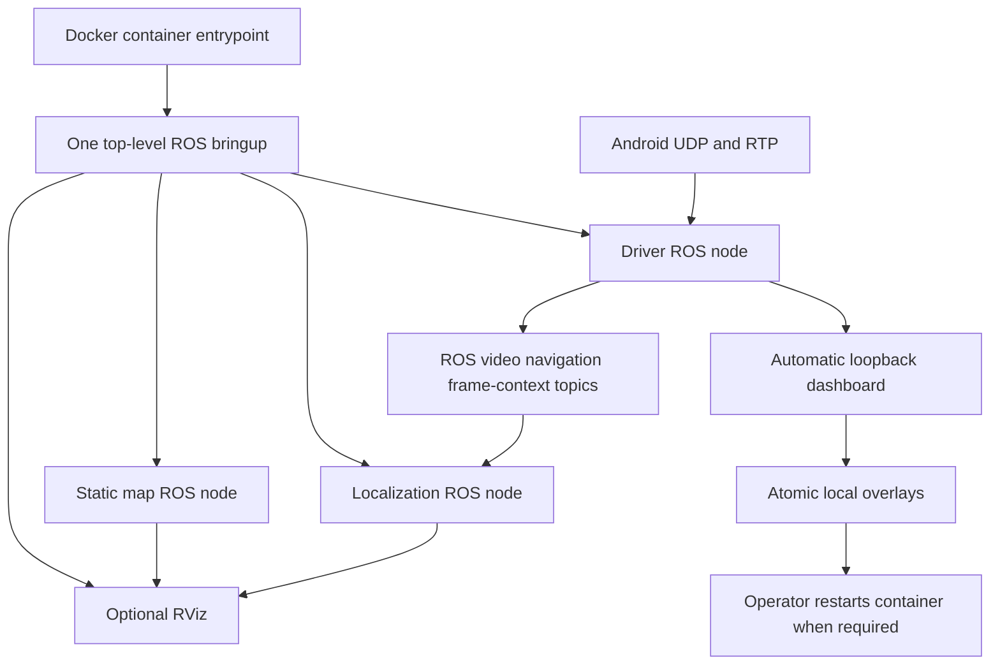
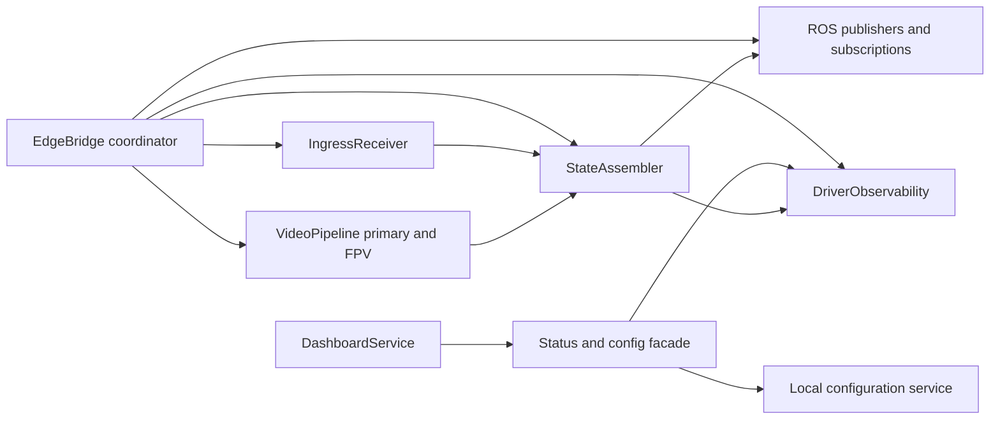
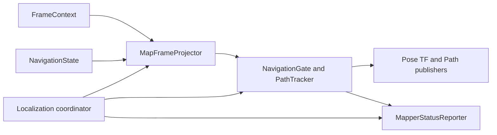

# Edge Lifecycle and Component Boundaries - Plan

## Goal Capsule

- **Objective:** An operator can start one reliable Edge stack and receive Android video, telemetry, map, path, RViz, evidence, and dashboard status without competing restart logic or hidden configuration selection.
- **Means:** Keep the two-package ROS 2 workspace and the existing three functional processes. Reduce each long-lived ROS node to a coordinator that composes focused internal classes. (KTD1, KTD2)
- **Authority:** The Android wire contract, the existing direct UDP/RTP architecture, source-time rules, KISS, low latency, Docker-only ROS 2 workflow, and manual-flight boundary override this plan.
- **Execution profile:** Characterize existing behavior before moving a boundary. Build and test in the project Humble container. Perform the final integrated tablet/drone acceptance only after source and container checks pass.
- **Stop conditions:** Stop and surface a blocker if the refactor requires an Android protocol change, adds a ROS package or process without a measured need, changes fixed ports or RTP payload type, or makes source timing less trustworthy.
- **Tail ownership:** The implementation validates the static map, navigation path, Primary and FPV publication, dashboard persistence, and clean shutdown. A props-off hardware session remains the final proof.

---

## Product Contract

### Summary

This plan makes the Edge runtime easier to operate and diagnose by giving it one lifecycle authority, explicit configuration sources, and small internal ownership boundaries. The dashboard starts automatically when its loopback port is available, but it never controls transport lifetime.

### Problem Frame

The current runtime has one oversized driver node, launch-level and shell-level lifecycle decisions, and dashboard-triggered restart markers. Configuration is split between defaults, YAML files, hidden local-file discovery, and dashboard writes. This makes a transport fault difficult to separate from a dashboard, mapper, or restart fault.

### Requirements

**Runtime shape**

- R1. The workspace keeps exactly two ROS 2 packages: `dji_edge_driver` and `dji_edge_mapper`.
- R2. The normal container entry starts one top-level ROS bringup. There is no shell restart loop and no dashboard-created restart marker.
- R3. The top-level bringup owns required-process shutdown. It starts the driver, static map publisher, localization node, and optional RViz.
- R4. The driver remains one ROS node. The static map publisher remains one small C++ ROS node. The localization process remains one ROS node.

**Transport and timing**

- R5. Android contract inputs remain UDP 5500, 5501, 5502, 5600, and 5610 with RTP payload type 96.
- R6. The driver keeps one GStreamer decode per video feed, bounded latest-frame publication, source timestamp preservation, clock mapping, frame association, the existing navigation and gimbal-pitch telemetry fields, and separate Primary and FPV topics.
- R7. The refactor must not add a relay, raw-video copy path, polling loop, or ROS callback on the GStreamer hot path.

**Dashboard and configuration**

- R8. The dashboard starts automatically by default when available. A dashboard bind or HTTP failure is visible in diagnostics but does not stop UDP ingress, video, ROS publication, map, or localization.
- R9. Dashboard saves remain functional and atomic. Saved values persist in explicit local overlays. A saved value that needs process reconstruction reports that a container restart is required.
- R10. `bridge.yaml` and `mapper.yaml` are the canonical package defaults. Local site and runtime overlays are explicit launch inputs, not hidden filesystem discovery.

**Failure behavior and workspace hygiene**

- R11. A required UDP ingress bind failure and a required mapper process exit terminate bringup. Primary pipeline failure is a visible degraded state without an automatic restart loop. FPV, evidence, and dashboard failures remain visible degraded states.
- R12. Root `build/`, `install/`, and `log/` are treated as disposable generated artifacts. A clean Humble rebuild must not depend on stale generated files.
- R13. Map configuration, calibration, PCD assets, evidence, raw RTP capture, rosbag data, and runtime overlays remain local and ignored by Git.

### Key Decisions

- **One normal lifecycle authority.** The container invokes the top-level ROS launch. The launch owns process shutdown. Docker is the external restart authority. Governs R2, R3, R11.
- **Dashboard is automatic but non-critical.** It is present for normal field use when its loopback service starts, but transport does not depend on it. Governs R8, R9.
- **Internal components instead of more ROS nodes.** The driver and localization nodes use focused classes rather than new nodes or packages. Governs R1, R4, R6, R7.

### Success Criteria

- One normal startup path starts the complete stack and releases all ports after shutdown.
- The dashboard remains reachable in the normal case and a forced dashboard failure leaves data transport alive.
- A clean container build from an empty `build/`, `install/`, and `log/` passes all package tests.
- Synthetic ingress proves Primary, FPV, navigation, frame context, mapper path, and failure policy behavior after the refactor.

### Scope Boundaries

- In scope: Edge-side lifecycle, internal component boundaries, configuration resolution, dashboard persistence boundary, tests, documentation, and generated-artifact cleanup.
- Out of scope: Android SDK changes, port or RTP changes, codec changes, new ROS packages, new ROS nodes, detection, rosbag policy changes, map calibration changes, and aircraft control.

#### Deferred to Follow-Up Work

- Live primary/FPV latency and loss acceptance with the aircraft powered and props off.
- Any container image or external Compose redesign beyond documenting the required entrypoint contract.

### Acceptance Examples

- AE1. When the dashboard port is occupied, the driver reports the dashboard error while UDP/RTP ingress and ROS publication remain available.
- AE2. When the operator saves dashboard configuration, the overlay changes atomically and the dashboard reports whether a container restart is needed. It does not stop or relaunch the current stack.
- AE3. When the primary pipeline fails, diagnostics show Primary degraded and the process remains inspectable. When the mapper process exits, top-level bringup shuts down.
- AE4. When generated ROS artifacts are removed, a fresh container build and headless launch recreate only current artifacts.

---

## Planning Contract

### Key Technical Decisions

- KTD1. **Keep the process count, shrink node ownership.** (session-settled: user-directed — chosen over splitting helpers into more ROS nodes: KISS requires focused classes inside each existing node.) `EdgeBridge` becomes a ROS-facing coordinator. `DroneLocalizationNode` becomes a ROS-facing coordinator. `map_publisher` stays a small C++ publisher. This governs R1, R4, R6, and R7.
- KTD2. **Use one top-level launch and no in-band restart request.** (session-settled: user-approved — chosen over shell-loop, launch-handler, and dashboard-marker restart ownership: one lifecycle authority is easier to reason about.) The installed bringup executable only prepares the ROS environment and `exec`s the top-level launch. Dashboard save returns pending-restart state. This governs R2, R3, R9, and R11.
- KTD3. **Use explicit overlay arguments.** Package YAML remains the default. The top-level launch accepts optional driver, mapper-site, and mapper-runtime overlay paths. Missing optional overlays are represented by an empty argument, not by launch-time file probing. This governs R10 and R13.
- KTD4. **Classify failures at ownership boundaries.** Ingress bind and mapper death are fatal to top-level bringup. Primary decode is degraded. FPV decode, evidence, and dashboard failures are degraded. No component independently restarts the system. This governs R8 and R11.
- KTD5. **Do not make the dashboard a launch or configuration choice.** Remove `dashboard_enabled`; the driver always attempts to start the loopback dashboard. “Optional” means a dashboard failure is isolated and never blocks transport, not that field operation needs a dashboard flag. This governs R8 and R9.

### High-Level Technical Design

### System-Wide Impact

- Operators use one normal command path. They can observe dashboard status without making transport depend on a browser.
- Android remains the protocol owner. This plan changes only the Edge internals that receive its data.
- ROS consumers keep their current topics and message contracts. Mapper and RViz continue to use the existing static map and path flow.
- Docker provides restart policy outside the ROS graph. The repository documents the entrypoint contract but does not change user-managed Compose services in this plan.

### Risks and Dependencies

- Moving GStreamer callbacks can add copies or reorder frame association. Characterization tests and retained bounded queues are required before the driver split.
- A single launch file can accidentally weaken mapper shutdown behavior. Launch tests must cover each critical process exit.
- Explicit overlay arguments can make a private site configuration unavailable if operator tooling is not updated. Documentation must state the exact overlay roles and public-clone behavior.
- Generated-artifact cleanup is destructive only for root ROS build products. It must not remove source, ignored map assets, overlays, evidence, or rosbag recordings.

### Sources and Research

- `src/dji_edge_driver/scripts/dji_edge_driver_node.py` currently contains `UdpEndpoint`, `VideoFeed`, `EdgeBridge`, dashboard construction, configuration persistence, evidence, clock, and ROS publication.
- `src/dji_edge_driver/launch/dji_edge_bringup.launch.py`, `src/dji_edge_driver/launch/dji_edge_driver.launch.py`, and `src/dji_edge_driver/scripts/dji_edge_bringup.sh` currently each influence lifecycle.
- `src/dji_edge_mapper/launch/dji_edge_mapper.launch.py` starts the C++ map publisher and Python localization node. `src/dji_edge_mapper/scripts/drone_localization_node.py` currently combines parameter resolution, projection, gates, path state, and ROS publication.
- `docs/plans/2026-09-04-1810-fix-edge-reliability-hardening-plan.md` records the current dashboard failure-soft and restart-marker behavior that this plan supersedes.

---

## Implementation Units

### U1. Characterize the current public contracts

- **Goal:** Lock down behavior that the refactor must preserve before moving lifecycle or component boundaries.
- **Requirements:** R1, R5, R6, R8, R13.
- **Dependencies:** None.
- **Files:** `src/dji_edge_driver/test/test_transport_core.py`, `src/dji_edge_driver/test/test_bringup_launch.py`, `src/dji_edge_driver/test/test_dji_edge_bringup_supervisor.py`, `src/dji_edge_mapper/test/test_public_install_layout.py`, `README.md`.
- **Approach:** Add characterization coverage for fixed protocol inputs, current ROS topics, local dashboard availability, mapper/public-clone behavior, and no extra package manifests. Mark restart-marker behavior as legacy coverage to be replaced by U2.
- **Execution note:** Add tests before removing lifecycle behavior or moving hot-path code.
- **Patterns to follow:** Existing synthetic RTP, dashboard callback, installed-layout, and supervisor tests.
- **Test scenarios:**
  - A complete bringup description creates driver, map, localization, and optional RViz actions with the fixed topic and port configuration.
  - Public-package layout excludes local map and calibration assets while the driver can still start without mapper configuration.
  - Synthetic telemetry, including navigation and gimbal pitch, remains intact; synthetic primary RTP and frame metadata still produce a bounded latest frame and frame context association.
  - Dashboard failure remains distinct from transport failure.
- **Verification:** The preserved contract is represented by focused tests before structural implementation begins.

### U2. Replace lifecycle duplication with one bringup authority

- **Goal:** Remove restart-marker and shell-loop ownership while retaining one normal installed startup command.
- **Requirements:** R2, R3, R11, AE2, AE3.
- **Dependencies:** U1.
- **Files:** `src/dji_edge_driver/launch/dji_edge_bringup.launch.py`, `src/dji_edge_driver/launch/dji_edge_driver.launch.py`, `src/dji_edge_mapper/launch/dji_edge_mapper.launch.py`, `src/dji_edge_driver/scripts/dji_edge_bringup.sh`, `src/dji_edge_driver/CMakeLists.txt`, `src/dji_edge_driver/test/test_bringup_launch.py`, `src/dji_edge_driver/test/test_dji_edge_bringup_supervisor.py`, `README.md`.
- **Approach:** Make the top-level launch instantiate the required processes and own their shutdown policy. Fold the current driver and mapper launch content into it, then remove those subordinate launch files as lifecycle surfaces; `ros2 run` remains the diagnostic path for an individual process. Remove the shell relaunch loop. Retain an installed executable only as a thin environment bootstrap that `exec`s top-level bringup. Remove restart-marker handling and dashboard shutdown callbacks.
- **Patterns to follow:** Existing installed executable naming and top-level RViz configuration lookup.
- **Test scenarios:**
  - Normal installed bringup has one lifecycle authority and no restart-marker dependency.
  - Driver, map publisher, or localization exit triggers top-level shutdown.
  - RViz exit does not make the transport restart.
  - Normal shutdown releases dashboard and UDP ports without relaunch.
- **Verification:** A headless Humble smoke starts and stops one process tree with no automatic second launch.

### U3. Consolidate configuration and local overlays

- **Goal:** Make the effective driver and mapper configuration traceable from canonical YAML plus explicit optional overlays.
- **Requirements:** R8, R9, R10, R13, AE1, AE2.
- **Dependencies:** U2.
- **Files:** `src/dji_edge_driver/config/bridge.yaml`, `src/dji_edge_mapper/config/mapper.yaml`, `src/dji_edge_driver/launch/dji_edge_bringup.launch.py`, `src/dji_edge_driver/dji_edge_transport_core/local_config.py`, `src/dji_edge_driver/dji_edge_transport_core/mapper_config.py`, `src/dji_edge_driver/dji_edge_transport_core/dashboard.py`, `src/dji_edge_driver/test/test_transport_core.py`, `src/dji_edge_mapper/test/test_public_install_layout.py`, `README.md`.
- **Approach:** Move normal defaults to package YAML. Keep only safety defaults in Python and remove the `dashboard_enabled` parameter entirely. Define explicit top-level arguments for a driver overlay, a private mapper-site overlay, and a mapper-runtime overlay. Save dashboard values atomically to the runtime overlays, remove the restart request field from its API, and report pending restart without controlling process state.
- **Patterns to follow:** Existing allowlisted atomic writers and private/public mapper installation boundary.
- **Test scenarios:**
  - Missing optional overlays use installed package defaults without source-tree probing.
  - A valid dashboard save changes only allowlisted local values and reports restart required when applicable.
  - Invalid overlay content or write failure leaves prior configuration intact.
  - Dashboard bind failure leaves the canonical configuration and driver initialization intact.
- **Verification:** State output identifies canonical, site, and runtime configuration sources without exposing private asset contents.

### U4. Extract focused driver components without adding ROS nodes

- **Goal:** Turn `EdgeBridge` into a coordinator that composes ingress, video, state association, observability, and dashboard-facing services.
- **Requirements:** R4, R5, R6, R7, R8, R11, AE1, AE3.
- **Dependencies:** U1, U2, U3.
- **Files:** `src/dji_edge_driver/scripts/dji_edge_driver_node.py`, `src/dji_edge_driver/dji_edge_transport_core/ingress.py`, `src/dji_edge_driver/dji_edge_transport_core/video_pipeline.py`, `src/dji_edge_driver/dji_edge_transport_core/state_assembler.py`, `src/dji_edge_driver/dji_edge_transport_core/observability.py`, `src/dji_edge_driver/dji_edge_transport_core/dashboard.py`, `src/dji_edge_driver/dji_edge_transport_core/evidence.py`, `src/dji_edge_driver/dji_edge_transport_core/clock_client.py`, `src/dji_edge_driver/test/test_transport_core.py`, `src/dji_edge_driver/test/test_gstreamer_pts.py`.
- **Approach:** Move UDP socket ownership to `IngressReceiver`. Move per-feed GStreamer and bounded frame state to `VideoPipeline`. Move JSON validation, sequence tracking, clock handling, latest telemetry, and frame association to `StateAssembler`. Move evidence, diagnostics snapshots, and failure classification to `DriverObservability`. Keep ROS publishers, subscriptions, timers, construction, and shutdown in `EdgeBridge`. Give the dashboard only a narrow status/config facade.
- **Execution note:** Preserve the current GStreamer pads, queue bounds, and callback-to-ROS handoff before changing names or module locations.
- **Patterns to follow:** `LatestFrameBuffer`, `RtpPtsBinding`, `ClockPinger`, `LatestState`, `IngressMetrics`, and the existing optional dashboard callback injection.
- **Test scenarios:**
  - Telemetry, frame metadata, and clock datagrams reach the state assembler with their original Android fields unchanged.
  - Invalid datagrams increment ingress rejection and evidence without poisoning valid state.
  - Primary and FPV pipelines keep independent metrics, bounded queues, image topics, and frame-context topics.
  - No ROS publication occurs from GStreamer callbacks.
  - A Primary initialization failure reports degraded state and keeps diagnostics/dashboard service available.
  - Dashboard server failure is non-fatal and cannot request node shutdown.
- **Verification:** `EdgeBridge` contains only ROS coordination and lifecycle wiring. Each extracted component has direct unit coverage for its boundary.

### U5. Reduce localization node ownership and share mapper inputs

- **Goal:** Make `DroneLocalizationNode` a small ROS coordinator while retaining the existing map publisher and mapper process count.
- **Requirements:** R4, R6, R10, R11, R13.
- **Dependencies:** U1, U2, U3.
- **Files:** `src/dji_edge_mapper/scripts/drone_localization_node.py`, `src/dji_edge_mapper/dji_edge_mapper_core/__init__.py`, `src/dji_edge_mapper/dji_edge_mapper_core/localization.py`, `src/dji_edge_mapper/dji_edge_mapper_core/config.py`, `src/dji_edge_mapper/src/map_publisher.cpp`, `src/dji_edge_mapper/test/test_localization_core.py`, `src/dji_edge_mapper/test/test_public_install_layout.py`, `src/dji_edge_mapper/CMakeLists.txt`.
- **Approach:** Extract map-frame projection and validation into a pure component. Extract navigation jump gating and path retention into a state component. Extract mapper-status serialization into a reporting component. Keep subscriptions, publishers, TF, timers, and shutdown in `DroneLocalizationNode`. Pass resolved map asset parameters once from the top-level configuration to both mapper processes. Keep `map_publisher` small; change it only to consume the same explicit parameter contract.
- **Execution note:** Characterize valid RTK, GPS fallback, path spacing, bounds, jump rejection, and per-frame pose behavior before relocating code.
- **Patterns to follow:** Existing reliable/best-effort QoS helpers, `FrameContext` association checks, and transient-local path/status topics.
- **Test scenarios:**
  - Valid RTK and valid GPS fallback project to the same local map frame rules.
  - Invalid coordinates, projection failures, map-bound violations, and jump-gate failures do not mutate path state.
  - Path spacing and history caps retain current behavior.
  - An associated frame context publishes a frame pose without changing navigation-path state.
  - Map and localization use the same explicit map metadata input.
- **Verification:** Localization behavior is covered by pure Python tests and the ROS node contains only adapter responsibilities.

### U6. Encode failure policy and observability boundaries

- **Goal:** Make fatal and degraded states predictable instead of allowing each component to decide its own lifecycle.
- **Requirements:** R8, R11, AE1, AE3.
- **Dependencies:** U2, U4, U5.
- **Files:** `src/dji_edge_driver/dji_edge_transport_core/observability.py`, `src/dji_edge_driver/scripts/dji_edge_driver_node.py`, `src/dji_edge_driver/dji_edge_transport_core/dashboard.py`, `src/dji_edge_driver/test/test_transport_core.py`, `src/dji_edge_driver/test/test_bringup_launch.py`, `src/dji_edge_mapper/test/test_localization_core.py`, `README.md`.
- **Approach:** Represent ingress, video, dashboard, evidence, and mapper conditions as one bounded diagnostic policy. Make critical startup failures observable before top-level shutdown. Keep degraded components running when their state can still aid diagnosis. Do not add a retry loop or process manager inside a ROS node.
- **Patterns to follow:** Existing diagnostic messages, endpoint error state, evidence writer health, and mapper status cache.
- **Test scenarios:**
  - A UDP bind failure creates a fatal driver status and causes required launch shutdown.
  - Primary failure remains degraded and does not cause a relaunch loop.
  - FPV failure leaves Primary and navigation operational.
  - Evidence write failure is surfaced while live transport remains operational.
  - Dashboard failure is visible but non-fatal.
- **Verification:** Dashboard and ROS diagnostics express the same failure classification without duplicated lifecycle actions.

### U7. Rebuild cleanly and document the operational contract

- **Goal:** Remove stale generated ROS artifacts safely and make normal versus diagnostic operation unambiguous.
- **Requirements:** R2, R8, R9, R10, R12, R13, AE4.
- **Dependencies:** U2, U3, U4, U5, U6.
- **Files:** `.gitignore`, `README.md`, `docs/PROTOCOL_V1.md`, `src/dji_edge_driver/test/test_bringup_launch.py`, `src/dji_edge_driver/test/test_transport_core.py`, `src/dji_edge_mapper/test/test_public_install_layout.py`.
- **Approach:** Document the container entrypoint, explicit overlay roles, dashboard save/pending-restart behavior, required external container restart, and generated-artifact cleanup boundary. Remove only root `build/`, `install/`, and `log/` after confirming no stack uses them. Rebuild from the Humble container and keep evidence, overlays, maps, calibration, and rosbag data untouched.
- **Execution note:** Use a fresh generated workspace as the installation smoke, not a source-tree fallback.
- **Patterns to follow:** Existing public-clone privacy rules and local-only dashboard documentation.
- **Test scenarios:**
  - A clean workspace rebuild installs both packages and their public assets.
  - Installed bringup works without source-tree launch paths.
  - A public clone without its required local map overlay rejects full mapper bringup as a clear setup error; package installation and isolated driver diagnostics remain available.
  - Documentation distinguishes automatic dashboard start from dashboard dependency and from operator-controlled container restart.
- **Verification:** The normal container procedure yields one running stack, one dashboard when available, and no stale generated artifacts required for success.

---

## Verification Contract

| Gate | Applies to | Done signal |
| --- | --- | --- |
| Focused Python and launch tests | U1-U6 | Driver, launch, supervisor-replacement, dashboard, RTP, and localization tests pass in Humble. |
| ROS package build | U2-U7 | A clean `colcon` build produces only the two packages and their installed public assets. |
| Headless bringup smoke | U2-U7 | Driver, map, localization, and dashboard start under one top-level launch; normal shutdown releases UDP and dashboard ports. |
| Failure-policy smoke | U4-U6 | Forced dashboard, evidence, video, UDP, and mapper conditions match the declared fatal/degraded classification. |
| Public-clone layout check | U3, U5, U7 | Private map, calibration, runtime overlays, evidence, and generated artifacts are absent from tracked/install outputs. |
| Props-off hardware acceptance | U7 | Android ingress, Primary/FPV behavior, source-time association, navigation/path, RTK/GPS fallback, gimbal pitch, dashboard save, and restart-by-container behavior have recorded evidence. |

---

## Definition of Done

- The workspace still has exactly `dji_edge_driver` and `dji_edge_mapper` packages.
- The normal runtime has one top-level launch and no shell restart loop, restart marker, or dashboard process-control callback.
- Driver and localization coordinators delegate non-ROS work to focused internal classes without new ROS nodes.
- Fixed Android ports, RTP payload type, topics, source-time fields, navigation and gimbal-pitch telemetry, map frame, and manual-flight boundary remain unchanged.
- Dashboard starts automatically when available, saves allowlisted local configuration atomically, and never blocks transport or restarts it.
- Failure classification is tested and visible through diagnostics/dashboard state.
- Root ROS generated artifacts are rebuilt cleanly in the Humble container. No private local asset, evidence, or runtime configuration is deleted or tracked.
- All planned tests and the headless container smoke pass. Hardware claims remain limited to evidence obtained in the final props-off session.
