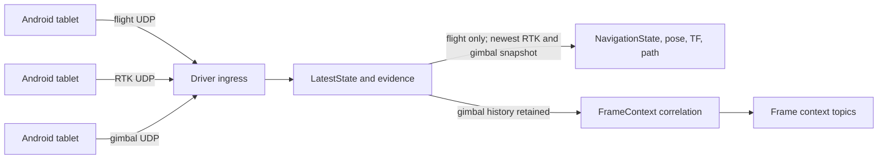
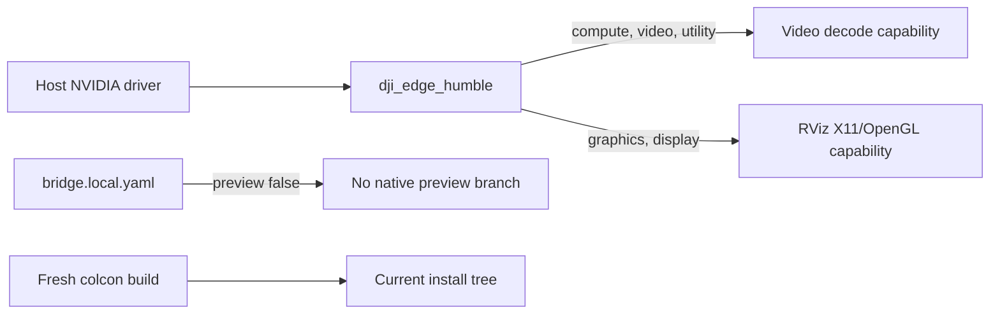

# Edge Preflight and Navigation Rate - Plan

## Goal Capsule

- **Objective:** Make tomorrow's Edge bringup lighter and predictable without changing the Android contract, video transport, or mapper behavior.
- **Means:** Enable container graphics capability for RViz, enforce headless native-preview configuration, rebuild the ROS workspace from clean artifacts, and publish navigation only after position-bearing flight updates.
- **Success:** RViz can use the container GPU display path, normal operation has no native GStreamer preview window, the workspace has only fresh colcon artifacts, and each flight-rate navigation snapshot uses the newest RTK and gimbal state without redundant navigation/path work.

## Product Contract

### Problem Frame

The current source is close to the intended two-package design, but an old local override enables native preview, stale colcon artifacts hide the real install layout, and every gimbal update republishes navigation. These conditions add CPU/DDS/RViz load and make a clean test harder to interpret.

### Requirements

#### Runtime and workspace

- R1. The `dji_edge_humble` service must expose the NVIDIA capabilities required for CUDA video decode and X11/OpenGL display, without changing any other Docker service.
- R2. Normal Edge operation must use `preview_windows: false`; native GStreamer preview remains a deliberate diagnostic opt-in only.
- R3. The workspace root must contain fresh `build/`, `install/`, and `log/` artifacts produced from the current `src/` tree after the cleanup.

#### Navigation publication

- R4. Only an accepted, newest `flight` packet may trigger `NavigationState`, pose, TF, and path publication. This makes flight the bounded position-publication cadence.
- R5. Accepted RTK and gimbal packets must still update `LatestState`, evidence, and temporal correlation. The next flight publication must use the newest valid RTK and gimbal values; neither packet type independently publishes navigation.

### Key Decisions

- **Use the existing one-service GPU setup.** `(session-settled: user-directed — chosen over a second Edge image or service: preserve the project Compose layout and touch only this project's service.)` Governs R1.
- **Keep GStreamer preview available but off.** `(session-settled: user-directed — chosen over normal preview windows: ROS is the operational video route and the preview is not part of the hot path.)` Governs R2.
- **Use flight as the navigation clock.** `(session-settled: user-directed — chosen over publishing navigation on every telemetry packet: retain the latest RTK and gimbal state while keeping Path and TF at the slower flight cadence.)` Governs R4, R5.

### Scope Boundaries

**In scope**

- The `dji_edge_humble` graphics capability environment value.
- The ignored local Edge override used by this laptop.
- Exact root-level `build/`, `install/`, and `log/` cleanup followed by a fresh Humble build/test.
- The driver trigger that publishes navigation after accepted telemetry.

**Out of scope**

- Android/tablet code, UDP ports, RTP/H.264 contract, source timestamps, decoder selection, packet-copy refactor, dashboard behavior, mapper logic, map data, and RViz layout.
- Adding ROS nodes, changing the two-package layout, or changing Docker services other than `dji_edge_humble`.

### Acceptance Examples

- AE1. Given `bridge.local.yaml` exists, when normal bringup starts, it resolves `preview_windows: false` and opens no native GStreamer video window.
- AE2. Given a valid RTK or gimbal packet, when the driver accepts it, then state and evidence update but `publish_navigation()` is not called.
- AE3. Given a valid newest flight packet, when the driver accepts it, then navigation publication includes the newest valid RTK and gimbal values and the mapper can extend `/dji/navigation/path`.
- AE4. Given the old artifacts were removed, when the standard Humble build completes, then the running install tree contains only files installed by the current source tree.

## Planning Contract

### Key Technical Decisions

- KTD1. **Add `graphics,display` to the current explicit NVIDIA capability list.** Keep `compute,video,utility` and add the two capabilities needed for OpenGL/X11 rendering. Do not replace the value with `all`; the explicit list documents the minimum needed by this service. Governs R1.
- KTD2. **Fix the runtime override, not the package default.** The package YAML and both launch files already default `preview_windows` to `false`. Correct only the ignored `bridge.local.yaml` value that currently overrides it. Governs R2.
- KTD3. **Perform a controlled clean rebuild.** Verify the shell is the workspace root and the targets are exactly `build`, `install`, and `log` before removing them. Recreate them only through colcon. Governs R3.
- KTD4. **Publish navigation only on flight.** Ingest will continue to process all accepted packet types first. Its final navigation trigger changes from `{flight, rtk, gimbal}` to `flight`; the next flight snapshot consumes the newest valid RTK and gimbal state. Governs R4, R5.

### High-Level Technical Design

This is the intended operational flow, not implementation code.

### Current-State Findings

- `src/dji_edge_driver/config/bridge.yaml`, `src/dji_edge_driver/launch/dji_edge_driver.launch.py`, and `src/dji_edge_driver/launch/dji_edge_bringup.launch.py` already default `preview_windows` to `false`.
- The local `bridge.local.yaml` has previously set `preview_windows: true`, which has priority over the package configuration in `dji_edge_bringup.launch.py`.
- `src/dji_edge_driver/src/dji_edge_driver_node.py` accepts, stores, and records a packet before its navigation trigger. The trigger currently includes `flight`, `rtk`, and `gimbal`.
- The Edge Compose service already uses `gpus: all`, but its explicit `NVIDIA_DRIVER_CAPABILITIES` lacks `graphics,display`.
- Existing root `build/`, `install/`, and `log/` artifacts contain legacy files that no longer correspond to the source layout. A clean rebuild is needed before treating runtime results as source proof.

## Implementation Units

### U1. Expose the complete required NVIDIA capability set

- **Goal:** Allow RViz to use the container graphics/display route while preserving the current GPU video-decode route.
- **Requirements:** R1.
- **Files:** `../../Dockerfiles/docker-compose.yml` (external, user-approved scope; only `dji_edge_humble`).
- **Approach:** Change only this service's `NVIDIA_DRIVER_CAPABILITIES` value to `compute,video,utility,graphics,display`. Preserve `gpus: all`, host networking, mounts, image, and every other service unchanged.
- **Test scenarios:** Compose config resolves the updated environment for `dji_edge_humble`; the container still reports the NVIDIA device; RViz starts with the existing map configuration and appears as an NVIDIA client in `nvidia-smi` during a visible run.
- **Execution note:** This is a runtime smoke test. A successful package build alone does not prove OpenGL acceleration.
- **Dependencies:** None.

### U2. Restore headless operational configuration

- **Goal:** Remove the local native-preview override from normal operation.
- **Requirements:** R2.
- **Files:** `bridge.local.yaml` (ignored local runtime file), `README.md` only if its instructions no longer state that the dashboard value is a diagnostic opt-in.
- **Approach:** Set the local override to `preview_windows: false`. Keep `android_clock_host` and `capture_rtp` unchanged. Do not remove the dashboard control; it remains the explicit way to enable preview for a short diagnostic run.
- **Test scenarios:** Effective launch parameters resolve `preview_windows` to false; a headless bringup starts without X11/GStreamer windows; changing the dashboard control to true remains an intentional later opt-in, not the default.
- **Execution note:** Verify the effective file after saving because the local file replaces, rather than layers over, the package parameter file.
- **Dependencies:** None.

### U3. Rebuild from a clean colcon workspace

- **Goal:** Remove stale generated artifacts and prove the current source tree installs and tests correctly.
- **Requirements:** R3.
- **Files:** Root-level generated directories `build/`, `install/`, and `log/`; no source files are intentionally edited by this unit.
- **Approach:** Before destructive cleanup, confirm the workspace root and the three exact targets. Remove only those generated directories. Use the existing `dji_edge_humble` Compose service to run the release-style colcon build and test suite. Let colcon recreate the directories. Confirm that legacy module paths absent from `src/` no longer survive under `install/`.
- **Test scenarios:** Both ROS packages build with `--symlink-install` and Release configuration; `colcon test` passes; `colcon test-result --verbose` has no failures; the mapper starts using the current source/install layout and publishes the static point cloud once.
- **Execution note:** Preserve uncommitted source changes. The cleanup target is generated output only.
- **Dependencies:** U1, U2.

### U4. Stop gimbal packets from republishing navigation

- **Goal:** Keep RTK and gimbal values available for correlation while publishing navigation, TF, and Path only at the flight cadence.
- **Requirements:** R4, R5.
- **Files:** `src/dji_edge_driver/src/dji_edge_driver_node.py`, `src/dji_edge_driver/test/test_transport_core.py`.
- **Approach:** Keep decode, sequence validation, `LatestState.update_packet`, evidence writing, and temporal-correlation history unchanged. Restrict only the existing `publish_navigation()` condition to accepted newest `flight` packets. The existing navigation builder reads the newest valid RTK and gimbal state when flight publishes. Add focused characterization coverage around the driver ingress method with a mocked publisher so this frequency boundary cannot regress.
- **Test scenarios:** A newest gimbal packet updates stored gimbal state and does not call navigation publication; a newest RTK packet updates RTK state and does not call it; a newest flight packet calls it once and uses those newest values; an old or duplicate packet calls it zero times; a frame-context test still interpolates gimbal pitch from gimbal history.
- **Execution note:** Do not use a timer or a new ROS node. The existing data-driven cadence is the KISS boundary.
- **Dependencies:** U3.

### U5. Verify the complete limited change on the real runtime path

- **Goal:** Confirm the four changes improve operational load without changing transport or mapping behavior.
- **Requirements:** R1-R5.
- **Files:** No new production file; use the generated test/report/log artifacts from the current run.
- **Approach:** Run headless driver-plus-mapper bringup first. Confirm dashboard health, current parameter values, static map publication, navigation topic availability, and absence of native preview. Then run RViz with the existing configuration and check GPU process visibility. With tablet ingress available, compare navigation publication rate against flight cadence and verify the published snapshots use recent RTK and gimbal values.
- **Test scenarios:** No-tablet smoke remains alive and reports waiting-for-ingress rather than crashing; Primary failure/absence does not prevent mapper startup; a synthetic navigation message produces a map-frame path pose; a live gimbal update does not create a path update by itself.
- **Dependencies:** U1-U4.

## Verification Contract

| Gate | Evidence of success |
| --- | --- |
| Compose scope | `docker compose config` shows `graphics,display` only for `dji_edge_humble`; no unrelated service diff exists. |
| Clean build | In the Humble container, `colcon build --symlink-install --cmake-args -DCMAKE_BUILD_TYPE=Release` builds `dji_edge_driver` and `dji_edge_mapper`. |
| Tests | `colcon test` followed by `colcon test-result --verbose` passes, including the new gimbal-trigger characterization. |
| Headless smoke | Bringup with `preview_windows:=false` opens no GStreamer native window, dashboard stays available, and the static map publishes once. |
| Mapper proof | A valid map-frame navigation sample produces `/dji/navigation/path` with a pose. |
| Graphics proof | During visible RViz, `nvidia-smi` shows the RViz process and the UI remains responsive; if not, record the actual renderer before claiming acceleration. |
| Live ingress proof | With tablet data, RTK and gimbal changes remain represented in state/frame context while path/navigation updates follow only flight packets. |

## Risks and Dependencies

- NVIDIA graphics capability depends on the host driver, Docker NVIDIA runtime, X11 permission, and the actual RViz renderer. The configuration change enables the path but the visible RViz check is required.
- Clean artifact removal is destructive only to generated directories. It must never run outside the repository workspace.
- `bridge.local.yaml` is intentionally ignored and machine-specific. It is not a public default and must not be committed.
- An RTK-only or gimbal-only run will no longer advance the path. That is intended: a flight snapshot publishes the newest position-bearing and orientation state, while RTK and gimbal remain independently correlated to frames.

## Sources and Research

- `src/dji_edge_driver/src/dji_edge_driver_node.py` — ingress ordering and current navigation trigger.
- `src/dji_edge_driver/config/bridge.yaml` and `src/dji_edge_driver/launch/` — source defaults already headless.
- `../../Dockerfiles/docker-compose.yml` — current Edge service GPU configuration.
- `docs/plans/2026-09-09-0516-perf-direct-ros-video-plan.md` — related video-path direction; its wider decoder/copy work remains outside this plan.

## Definition of Done

- Only `dji_edge_humble` receives the two additional graphics capabilities.
- The local runtime configuration defaults to headless preview and does not alter clock or capture settings.
- `build/`, `install/`, and `log/` are fresh outputs from the current source tree, and both packages pass their Humble tests.
- RTK and gimbal input still update state/evidence/frame correlation but cannot independently publish navigation, pose, TF, or path; the next flight snapshot includes their newest valid values.
- Headless bringup, static map publication, dashboard availability, map-path publication, and RViz graphics behavior are verified on the normal container path.
- No Android protocol, source-time rule, video pipeline, mapper behavior, dashboard feature, or unrelated Docker service is changed.
