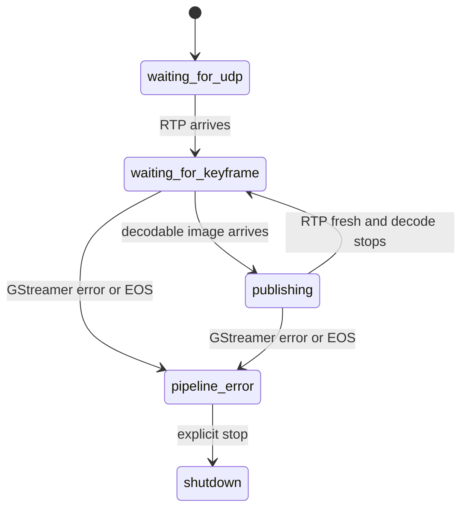

# feat: Complete clean Primary C++ edge transport - Plan

## Goal Capsule

- **Objective:** Run reliable, low-latency Primary video and navigation from Android UDP into ROS 2 Humble without giving an image the wrong location.
- **Means:** Complete `dji_edge_transport` as the clean C++ driver and keep `dji_edge_mapper` as the only other package.
- **Authority:** `docs/PROTOCOL_V1.md` owns Android ports, packet form, RTP/H.264, and Android/DJI source timestamps.
- **Execution profile:** Contract tests, Humble verification, then a props-off tablet bench before legacy retirement.
- **Stop conditions:** Do not change Android, ports, payload type, source timestamps, map calibration, flight controls, or FPV behavior. Do not delete `dji_edge_driver` before live equivalence evidence exists.

---

## Product Contract

### Summary

`dji_edge_transport` is the new driver. It receives compact Android JSON on UDP 5500/5501/5502 and Primary H.264/RTP on UDP 5600. It publishes the newest decodable Primary image, navigation, frame context, diagnostics, and an optional loopback dashboard.

`dji_edge_driver` is not a migration source. It stays untouched and inactive as a fallback while the new transport is proven. Only necessary ROS topic and message semantics are reproduced.

### Problem Frame

The previous path can restart a decoder after a stall, do packet work in the video hot path, and attach a decoded frame to the last RTP packet seen. The last behavior can make a visually correct image carry a false location. The replacement must prefer unavailable context over false precision.

### Requirements

- R1. Accept canonical compact `data.fields` telemetry and canonical `video_au` metadata from `docs/PROTOCOL_V1.md`.
- R2. Publish `ASSOCIATION_UNAVAILABLE` unless an image has a proven access-unit identity. Never use the last RTP packet as frame identity.
- R3. Preserve Android/DJI timestamps. Edge receive, decode, and ROS delivery times remain diagnostics only.
- R4. Support Android-initiated ping on fixed UDP 5502 and Edge-initiated ping from an ephemeral IPv4 source socket.
- R5. Keep one headless Primary GStreamer pipeline, one `appsink`, one newest-frame handoff, and image QoS depth 1/best-effort.
- R6. Wait for a sender IDR after decode loss. Never recreate the pipeline automatically.
- R7. Keep evidence writes, raw RTP capture, dashboard work, preview rendering, and detailed packet accounting out of the normal video hot path.
- R8. Keep `dji_edge_mapper` consuming `dji_edge_transport` messages and publishing map, pose, path, TF, and frame pose.
- R9. Dashboard is optional and non-fatal. It observes state and persists narrow local settings, but never restarts or supervises transport.
- R10. End with only `dji_edge_transport` and `dji_edge_mapper`, after a props-off equivalence bench passes.
- R11. FPV is out of scope. This plan adds no FPV port, topic, decoder, preview, or dashboard card.

### Scope Boundaries

- No Python-driver implementation, watchdog, relay, `shmsink`, raw capture machinery, old dashboard HTML, or legacy launcher is copied.
- No raw RTP recording in normal operation.
- No sender-side loss recovery claim beyond waiting for a future IDR.
- No map calibration, UTM, point cloud, path-policy, RViz, or flight-control changes.

---

## Planning Contract

### Key Technical Decisions

- KTD1. **Fail closed for image context.** (session-settled: user-directed — chosen over inferred RTP matching: an incorrect mapped detection is worse than unavailable context.) Images always publish; context publishes only from proof.
- KTD2. **One live Primary pipeline.** (session-settled: user-directed — chosen over restart loops and preview branches: newest imagery and stable latency matter more than retaining every frame.) GStreamer waits for the next keyframe.
- KTD3. **Keep old driver isolated.** (session-settled: user-directed — chosen over migration/copying: the refactor must not import accumulated complexity.)
- KTD4. **Dashboard is observer-only.** It is loopback-only, optional, and outside the video path.
- KTD5. **FPV is deferred.** Prove Primary first.

### High-Level Technical Design

```mermaid
flowchart TB
  A[Android tablet] -->|telemetry JSON 5500| U[UDP JSON ingress]
  A -->|AU metadata JSON 5501| U
  A <-->|clock JSON 5502| C[Clock component]
  A -->|Primary H264 RTP 5600| G[one GStreamer pipeline]
  U --> S[Source-time state]
  U --> X[AU identity index]
  G --> H[one-slot newest frame handoff]
  H --> P[ROS Image publisher]
  X --> F[fail-closed FrameContext]
  S --> F
  P --> I[/dji/primary/image_raw]
  F --> T[/dji/primary/frame_context]
  S --> N[/dji/navigation/state]
  N --> M[dji_edge_mapper]
  T --> M
```



### Sequencing

1. Prove or remove unsafe AU association.
2. Complete clock and component source-time state.
3. Add current-contract and real-stream characterization gates.
4. Add clean bringup and optional dashboard.
5. Run props-off equivalence bench.
6. Remove legacy only after proof.

---

## Implementation Units

### U1. Make AU-to-frame identity fail closed

- **Goal:** Remove `last RTP` identity assignment from `PrimaryVideoPipeline` and publish context only from proven AU association.
- **Files:** `src/dji_edge_transport/include/dji_edge_transport/primary_video_pipeline.hpp`, `src/dji_edge_transport/src/primary_video_pipeline.cpp`, `src/dji_edge_transport/include/dji_edge_transport/source_time_state.hpp`, `src/dji_edge_transport/src/source_time_state.cpp`, `src/dji_edge_transport/src/transport_node.cpp`, `src/dji_edge_transport/test/test_primary_video_pipeline.cpp`, `src/dji_edge_transport/test/test_transport_node.cpp`.
- **Approach:** Characterize GStreamer PTS/RTP behavior with a deterministic fixture. Use a bounded AU index only if it proves a one-to-one key. Otherwise publish unavailable context.
- **Test scenarios:** matched AU preserves original Android times; absent metadata still publishes image but unavailable context; duplicate identity is unavailable; late metadata never relabels a past image; telemetry selection uses AU completion time.
- **Verification:** No decoded frame gets identity from mutable `last_rtp_*`; Humble tests cover success, ambiguity, and missing metadata.

### U2. Complete clock and source-time navigation

- **Goal:** Implement both clock directions and retain flight, RTK, and gimbal source times independently.
- **Files:** `src/dji_edge_transport/include/dji_edge_transport/clock_mapper.hpp`, `src/dji_edge_transport/src/clock_mapper.cpp`, `src/dji_edge_transport/include/dji_edge_transport/udp_receiver.hpp`, `src/dji_edge_transport/src/udp_receiver.cpp`, `src/dji_edge_transport/src/protocol_decoder.cpp`, `src/dji_edge_transport/src/source_time_state.cpp`, `src/dji_edge_transport/src/transport_node.cpp`, `src/dji_edge_transport/test/test_clock_mapper.cpp`, `src/dji_edge_transport/test/test_protocol_decoder.cpp`, `src/dji_edge_transport/test/test_source_time_state.cpp`.
- **Approach:** Fixed UDP 5502 responds to Android pings. A separate IPv4 socket sends Edge pings and validates matching pongs. RTK supplies latitude/longitude only when valid; flight keeps altitude and heading.
- **Test scenarios:** valid ping gets contract-shaped pong; mismatch is ignored; timeout is diagnostic only; GPS fallback continues; RTK cannot erase flight data; gimbal keeps its own Android timestamp.
- **Verification:** Clock values never enter source identity fields. Tests cover both directions and timeout.

### U3. Characterize contract and live Primary stream

- **Goal:** Replace shallow fixtures with current Android-contract coverage and a repeatable props-off bench.
- **Files:** `deploy/protocol/v1/golden_packets.json`, `src/dji_edge_transport/test/test_protocol_decoder.cpp`, `src/dji_edge_transport/test/test_transport_node.cpp`, `src/dji_edge_transport/test/test_primary_video_pipeline.cpp`, `README.md`, `docs/PROTOCOL_V1.md`.
- **Approach:** Update golden packets to compact schema. Test malformed, non-finite, out-of-order, duplicate, and per-type cases. Define a bench that records decoder, ingress/decode/publish counts, resolution, rates, context state, clock, and mapper path growth.
- **Test scenarios:** canonical flight/RTK/gimbal/health/AU packets decode; invalid packets do not mutate state; no RTP waits; RTP without IDR waits; real stream proves sustained publishing.
- **Verification:** Humble automated tests pass. Hardware evidence is labeled as hardware proof, not inferred from synthetic tests.

### U4. Add clean bringup and optional dashboard

- **Goal:** Launch the new two-package stack and RViz once, with a minimal optional dashboard outside the hot path.
- **Files:** `src/dji_edge_transport/launch/transport.launch.py`, `src/dji_edge_transport/launch/dji_edge_bringup.launch.py`, `src/dji_edge_transport/config/transport.yaml`, `src/dji_edge_transport/include/dji_edge_transport/dashboard_server.hpp`, `src/dji_edge_transport/src/dashboard_server.cpp`, `src/dji_edge_transport/src/transport_node.cpp`, `src/dji_edge_mapper/launch/dji_edge_mapper.launch.py`, `README.md`, `src/dji_edge_transport/test/test_bringup_launch.cpp`.
- **Approach:** Reimplement only loopback status/config: source address, clock target, decoder, ingress/decode/publish ages and rates, resolution, context count, and map/path status. Configuration applies on next explicit operator launch; no restart marker or loop.
- **Test scenarios:** one bringup starts transport/mapper/optional RViz; dashboard-disabled and port-busy cases leave transport alive; dashboard cannot change ports/RTP; no dashboard work occurs in GStreamer callback; headless launch needs no X11.
- **Verification:** ROS graph contains one transport node, mapper nodes, and optional RViz. No shell restart loop or legacy launch reference remains.

### U5. Prove equivalence then retire legacy

- **Goal:** Retire the legacy package only after the new Primary path proves operator behavior.
- **Files:** `README.md`, `AGENTS.md`, `.gitignore`, `src/dji_edge_driver/`, and new launch/config files needed by proof.
- **Approach:** Run the props-off bench while Android emits. Verify ingress/decode/publish, source-time honesty, clock, map, pose, path, and RViz. Stop retirement on any failure. If all pass, remove `src/dji_edge_driver` and stale references in one focused deletion.
- **Test scenarios:** new transport alone binds 5500/5501/5502/5600; mapper imports only new message types; no duplicate port owner/publisher exists; clean checkout discovers exactly two packages.
- **Verification:** Deletion requires recorded live bench evidence and a fresh Humble build/test. Dashboard and mapper work without legacy package.

---

## Verification Contract

| Gate | Applies to | Evidence |
| --- | --- | --- |
| Contract tests | U1-U3 | Canonical packets, rejection cases, AU identity, and clock directions pass in Humble. |
| Static hot-path audit | U1-U4 | One appsink/frame slot and no preview, relay, watchdog, raw capture, or detailed packet accounting in video callbacks. |
| Build/install | U1-U5 | `colcon build --symlink-install --cmake-args -DCMAKE_BUILD_TYPE=Release` succeeds in project Humble container. |
| Headless graph smoke | U4 | Bringup works without tablet/X11 and exposes expected nodes/topics. |
| Props-off Primary bench | U3-U5 | Tablet stream advances ingress/decode/publish; decoder is reported truthfully; no stale backlog. |
| Map bench | U3-U5 | Static PCD, pose, full path, and frame pose publish from new messages. |
| Retirement gate | U5 | All above evidence exists before legacy deletion. |

## Definition of Done

- `dji_edge_transport` is a clean C++ Primary driver with no runtime dependency on `dji_edge_driver`.
- Frame context cannot be falsely associated by mutable latest-RTP state.
- Clock, source-time telemetry, Primary decode, and ROS publication preserve Android contract.
- Dashboard is optional, narrow, local, and non-fatal.
- Mapper works with `dji_edge_transport` messages.
- FPV remains absent.
- A props-off tablet bench proves the new path before legacy deletion.
- A fresh Humble workspace ends with exactly `dji_edge_transport` and `dji_edge_mapper` and passes build/tests.

## Appendix

### Current baseline

`dji_edge_transport` builds in Humble, owns public navigation/frame-context messages, accepts compact flight fields, and merges causal flight/RTK/gimbal samples. It is not the active field launcher because AU identity and clock still need proof.

### Deferred to Follow-Up Work

- FPV transport and diagnostics.
- Bench-only raw RTP recording.
- GPU-native image transport after a measured Primary baseline proves CPU copies matter.
- Point cloud, calibration, and path-policy changes.
